# Import


```python
# Загрузка ОС и файлов для работы на Kaggle

import os
for dirname, _, filenames in os.walk('/kaggle/input'):
    for filename in filenames:
        print(os.path.join(dirname, filename))
```

    /kaggle/input/tripadvisor-map/tripadvisor_map.png
    /kaggle/input/world-cities/worldcities.csv
    /kaggle/input/ta-ratings-04-2021/TA_ratings_04_2021.csv
    /kaggle/input/sf-dst-restaurant-rating/sample_submission.csv
    /kaggle/input/sf-dst-restaurant-rating/main_task.csv
    /kaggle/input/sf-dst-restaurant-rating/kaggle_task.csv


```python
# Загрузка библиотек
import numpy as np
import pandas as pd
import re
from itertools import combinations
from statsmodels.stats import weightstats 

import requests
from bs4 import BeautifulSoup
from datetime import datetime, timedelta
from gensim.models import Word2Vec
from sklearn.manifold import TSNE

from tqdm import tqdm
tqdm.pandas(desc="Progress:")

import matplotlib.pyplot as plt
import seaborn as sns 
%matplotlib inline

from sklearn.preprocessing import StandardScaler
from sklearn.feature_selection import mutual_info_regression
from sklearn.model_selection import train_test_split, GridSearchCV
from sklearn.cluster import KMeans
from sklearn.linear_model import LinearRegression
from sklearn.ensemble import RandomForestRegressor, GradientBoostingRegressor
from sklearn.metrics import silhouette_score, mean_absolute_error
```


```python
# Фиксация random seed для воспроизводимости экспериментов
RS = 42
```


```python
# Фиксация версии пакетов, чтобы эксперименты были воспроизводимы:
!pip freeze > requirements.txt
```


```python
# Загрузка данных в переменные
DATA_DIR = '/kaggle/input/sf-dst-restaurant-rating/'
train = pd.read_csv(DATA_DIR+'/main_task.csv')
valid = pd.read_csv(DATA_DIR+'kaggle_task.csv')
sample_submission = pd.read_csv(DATA_DIR+'/sample_submission.csv')

# Объединяем данные, помячая тренировочные
train['train'] = 1
valid['train'] = 0
valid['Rating'] = 0.
data = train.append(valid, sort=False).reset_index(drop=True)
```

# Первичный взгляд на данные


```python
sample_submission.sample(5)
```


<div>
<style scoped>
    .dataframe tbody tr th:only-of-type {
        vertical-align: middle;
    }

    .dataframe tbody tr th {
        vertical-align: top;
    }

    .dataframe thead th {
        text-align: right;
    }
</style>
<table border="1" class="dataframe">
  <thead>
    <tr style="text-align: right;">
      <th></th>
      <th>Restaurant_id</th>
      <th>Rating</th>
    </tr>
  </thead>
  <tbody>
    <tr>
      <th>7819</th>
      <td>id_7819</td>
      <td>4.5</td>
    </tr>
    <tr>
      <th>1759</th>
      <td>id_1759</td>
      <td>5.0</td>
    </tr>
    <tr>
      <th>9142</th>
      <td>id_9142</td>
      <td>2.0</td>
    </tr>
    <tr>
      <th>9288</th>
      <td>id_9288</td>
      <td>1.0</td>
    </tr>
    <tr>
      <th>2168</th>
      <td>id_2168</td>
      <td>2.5</td>
    </tr>
  </tbody>
</table>
</div>


```python
data.sample(5)
```


<div>
<style scoped>
    .dataframe tbody tr th:only-of-type {
        vertical-align: middle;
    }

    .dataframe tbody tr th {
        vertical-align: top;
    }

    .dataframe thead th {
        text-align: right;
    }
</style>
<table border="1" class="dataframe">
  <thead>
    <tr style="text-align: right;">
      <th></th>
      <th>Restaurant_id</th>
      <th>City</th>
      <th>Cuisine Style</th>
      <th>Ranking</th>
      <th>Rating</th>
      <th>Price Range</th>
      <th>Number of Reviews</th>
      <th>Reviews</th>
      <th>URL_TA</th>
      <th>ID_TA</th>
      <th>train</th>
    </tr>
  </thead>
  <tbody>
    <tr>
      <th>31249</th>
      <td>id_1602</td>
      <td>Amsterdam</td>
      <td>['Bar', 'Pub']</td>
      <td>1606.0</td>
      <td>4.0</td>
      <td>$$ - $$$</td>
      <td>59.0</td>
      <td>[['Take a coffee and walk', 'Nice place'], ['1...</td>
      <td>/Restaurant_Review-g188590-d3961139-Reviews-Yi...</td>
      <td>d3961139</td>
      <td>1</td>
    </tr>
    <tr>
      <th>4417</th>
      <td>id_2678</td>
      <td>Lisbon</td>
      <td>['Portuguese', 'European']</td>
      <td>2681.0</td>
      <td>3.5</td>
      <td>$</td>
      <td>66.0</td>
      <td>[['Fish - fresh - local - low price', 'Good an...</td>
      <td>/Restaurant_Review-g189158-d3389742-Reviews-Os...</td>
      <td>d3389742</td>
      <td>1</td>
    </tr>
    <tr>
      <th>4663</th>
      <td>id_13347</td>
      <td>Paris</td>
      <td>['French']</td>
      <td>13349.0</td>
      <td>2.5</td>
      <td>$$ - $$$</td>
      <td>33.0</td>
      <td>[['I would avoid this place', 'Had to eat some...</td>
      <td>/Restaurant_Review-g187147-d3977929-Reviews-L_...</td>
      <td>d3977929</td>
      <td>1</td>
    </tr>
    <tr>
      <th>14887</th>
      <td>id_5625</td>
      <td>Madrid</td>
      <td>NaN</td>
      <td>5628.0</td>
      <td>4.0</td>
      <td>NaN</td>
      <td>5.0</td>
      <td>[[], []]</td>
      <td>/Restaurant_Review-g187514-d5794921-Reviews-Fu...</td>
      <td>d5794921</td>
      <td>1</td>
    </tr>
    <tr>
      <th>28547</th>
      <td>id_206</td>
      <td>Berlin</td>
      <td>['Italian', 'Mediterranean', 'European', 'Deli...</td>
      <td>207.0</td>
      <td>4.5</td>
      <td>$$ - $$$</td>
      <td>59.0</td>
      <td>[['Superb cocktail and good food', 'Top Qualit...</td>
      <td>/Restaurant_Review-g187323-d11890687-Reviews-S...</td>
      <td>d11890687</td>
      <td>1</td>
    </tr>
  </tbody>
</table>
</div>


## Описание полей

- Restaurant_id - ID
- City - Город 
- Cuisine Style - Кухня
- Ranking - Ранг ресторана относительно других ресторанов в этом городе
- Price Range - Цены в ресторане в 3 категориях
- Number of Reviews - Количество отзывов
- Reviews - 2 последних отзыва и даты этих отзывов
- URL_TA - Cтраница ресторана на 'www.tripadvisor.com' 
- ID_TA - ID ресторана в TripAdvisor
- Rating - Рейтинг ресторана


```python
data.info()
```

    <class 'pandas.core.frame.DataFrame'>
    RangeIndex: 50000 entries, 0 to 49999
    Data columns (total 11 columns):
    Restaurant_id        50000 non-null object
    City                 50000 non-null object
    Cuisine Style        38410 non-null object
    Ranking              50000 non-null float64
    Rating               50000 non-null float64
    Price Range          32639 non-null object
    Number of Reviews    46800 non-null float64
    Reviews              49998 non-null object
    URL_TA               50000 non-null object
    ID_TA                50000 non-null object
    train                50000 non-null int64
    dtypes: float64(3), int64(1), object(7)
    memory usage: 4.2+ MB


Бросается в глаза, признаки 'Cuisine Style' и 'Reviews' являют списками. В частности, в 'Reviews' есть даты. Для корректной работы необходимо извлечь из них полезную иформацию.

## Пропуски


```python
# Функция возвращяет визуализацию и относительную долю пропусков в данных
def na_values(df):
    fig, ax = plt.subplots(figsize=(12, 8))
    sns.heatmap(df.isnull(),
                yticklabels=False, 
                cbar=False,
                cmap='viridis')
    plt.show()
    
    for column in df.columns:
        value = df[column].isna().sum()
        if value > 0:
            print(column.upper())
            print('%% пропущенных данных в столбце: \t{}'.format(np.round(value/len(df[column])*100), 2))
            print('(%% от общего кол-ва данных: \t{})'.format(np.round(value/np.product(df.shape)*100), 2))
            print()
```


```python
na_values(data)
```


    
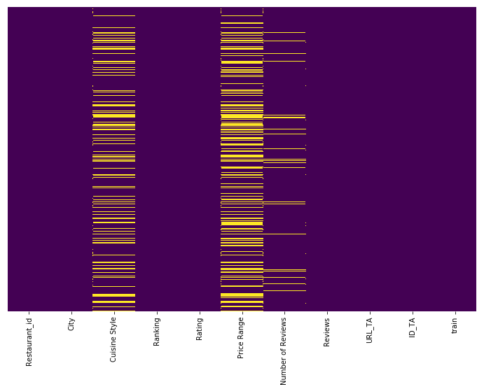
    


    CUISINE STYLE
    %% пропущенных данных в столбце: 	23.0
    (%% от общего кол-ва данных: 	2.0)
    
    PRICE RANGE
    %% пропущенных данных в столбце: 	35.0
    (%% от общего кол-ва данных: 	3.0)
    
    NUMBER OF REVIEWS
    %% пропущенных данных в столбце: 	6.0
    (%% от общего кол-ва данных: 	1.0)
    
    REVIEWS
    %% пропущенных данных в столбце: 	0.0
    (%% от общего кол-ва данных: 	0.0)
    


Более трети строк содержит пропуски. Перед тем как приступать к моделированию, будет необходимо их заполнить.

## ID дубликаты

Имеется три признака, которые должны быть уникальны для каждого ресторана:

    - 'Restaurant_id'
    - 'URL_TA'
    - 'ID_TA'
Имеет смысл проверить уникальность и удалить неинформативные признаки


```python
# Функция возвращает %% уникальных зачений для выбранных признаков
def unique_id_check(df, cols):
    for col in cols:
        print(col.upper())
        print('%% уникальных значений в столбце: \t{}'.format(np.round(len(df[col].unique())/df.shape[0]*100, 2)))
        print()
```


```python
unique_id_check(train, ['Restaurant_id','URL_TA','ID_TA'])
```

    RESTAURANT_ID
    %% уникальных значений в столбце: 	29.77
    
    URL_TA
    %% уникальных значений в столбце: 	99.95
    
    ID_TA
    %% уникальных значений в столбце: 	99.95
    


Значения не уникальны для всех трех признаков. Имеет смысл проверить, одинаковы ли дубликаты для 'URL_TA' и 'ID_TA'. И разобраться почему 'Restaurant_id' уникально меньше, чем для трети ресторанов.


```python
# Фунция возвращает дупликаты для наиболее уникального признака из списка
def cross_duplicates(df, cols):
    max_value = 0
    for col in cols:
        if len(train[col].unique()) >= max_value:
            max_value = len(train[col].unique())
            base = col
    cols.remove(base)
    dups = df[df[base].duplicated() == True][base].values
    
    for col in cols:
        count = 0
        for i in dups:
            if len(df[df[base] == i][col].unique()) > 1:
                print('Несколько значений {} для {} = {}'.format(col.upper(), 
                                                                 base.upper(), i))
                count += 1
        if count == 0:
            print('Значения {} уникальны для каждого {}'.format(col.upper(), base.upper()))
```


```python
cross_duplicates(train, ['Restaurant_id','URL_TA','ID_TA'])
```

    Несколько значений RESTAURANT_ID для ID_TA = d4600226
    Несколько значений RESTAURANT_ID для ID_TA = d11674463
    Несколько значений RESTAURANT_ID для ID_TA = d11921719
    Несколько значений RESTAURANT_ID для ID_TA = d9802625
    Несколько значений RESTAURANT_ID для ID_TA = d9877640
    Несколько значений RESTAURANT_ID для ID_TA = d7809594
    Несколько значений RESTAURANT_ID для ID_TA = d987900
    Несколько значений RESTAURANT_ID для ID_TA = d2477531
    Несколько значений RESTAURANT_ID для ID_TA = d1315077
    Несколько значений RESTAURANT_ID для ID_TA = d11698990
    Несколько значений RESTAURANT_ID для ID_TA = d13002276
    Несколько значений RESTAURANT_ID для ID_TA = d3685055
    Несколько значений RESTAURANT_ID для ID_TA = d697406
    Несколько значений RESTAURANT_ID для ID_TA = d11999956
    Несколько значений RESTAURANT_ID для ID_TA = d8753348
    Несколько значений RESTAURANT_ID для ID_TA = d7337366
    Несколько значений RESTAURANT_ID для ID_TA = d7342803
    Несколько значений RESTAURANT_ID для ID_TA = d793170
    Несколько значений RESTAURANT_ID для ID_TA = d10047799
    Несколько значений RESTAURANT_ID для ID_TA = d3161682
    Значения URL_TA уникальны для каждого ID_TA


Признаки 'URL_TA' и 'ID_TA'  дублируют друг друга. Что касается 'Restaurant_id', необходимо рассмотреть случаи, когда для 'ID_TA' данный признак разный и наоборот.


```python
# Пример, когда для одного 'ID_TA' несколько 'Restaurant_id'
train[train.ID_TA=='d4600226']
```


<div>
<style scoped>
    .dataframe tbody tr th:only-of-type {
        vertical-align: middle;
    }

    .dataframe tbody tr th {
        vertical-align: top;
    }

    .dataframe thead th {
        text-align: right;
    }
</style>
<table border="1" class="dataframe">
  <thead>
    <tr style="text-align: right;">
      <th></th>
      <th>Restaurant_id</th>
      <th>City</th>
      <th>Cuisine Style</th>
      <th>Ranking</th>
      <th>Rating</th>
      <th>Price Range</th>
      <th>Number of Reviews</th>
      <th>Reviews</th>
      <th>URL_TA</th>
      <th>ID_TA</th>
      <th>train</th>
    </tr>
  </thead>
  <tbody>
    <tr>
      <th>147</th>
      <td>id_4110</td>
      <td>Madrid</td>
      <td>['Spanish']</td>
      <td>4112.0</td>
      <td>5.0</td>
      <td>NaN</td>
      <td>2.0</td>
      <td>[[], []]</td>
      <td>/Restaurant_Review-g187514-d4600226-Reviews-Ca...</td>
      <td>d4600226</td>
      <td>1</td>
    </tr>
    <tr>
      <th>9446</th>
      <td>id_4104</td>
      <td>Madrid</td>
      <td>['Spanish']</td>
      <td>4106.0</td>
      <td>5.0</td>
      <td>NaN</td>
      <td>2.0</td>
      <td>[[], []]</td>
      <td>/Restaurant_Review-g187514-d4600226-Reviews-Ca...</td>
      <td>d4600226</td>
      <td>1</td>
    </tr>
  </tbody>
</table>
</div>


```python
# Разброс рейтинга для одинаковых 'ID_TA'
idd = train[train['ID_TA'].duplicated() == True]
idd = pd.concat([idd, train[train['ID_TA'].duplicated(keep='last') == True]])
(idd.groupby('ID_TA').Rating.max() - 
 idd.groupby('ID_TA').Rating.min()).value_counts(normalize = True)
```


    0.0    1.0
    Name: Rating, dtype: float64


```python
# Пример, когда для одного 'Restaurant_id' при нескольких 'ID_TA' и 'URL_TA'
# Для удобства выведены первые 5 примеров и ссылок
r_id_dups = train[train['Restaurant_id'].duplicated() == True]['Restaurant_id'].unique()
example = train[train['Restaurant_id'] == r_id_dups[0]].URL_TA.values
display(train[train['Restaurant_id'] == r_id_dups[0]].head(5))
example[:5]
```


<div>
<style scoped>
    .dataframe tbody tr th:only-of-type {
        vertical-align: middle;
    }

    .dataframe tbody tr th {
        vertical-align: top;
    }

    .dataframe thead th {
        text-align: right;
    }
</style>
<table border="1" class="dataframe">
  <thead>
    <tr style="text-align: right;">
      <th></th>
      <th>Restaurant_id</th>
      <th>City</th>
      <th>Cuisine Style</th>
      <th>Ranking</th>
      <th>Rating</th>
      <th>Price Range</th>
      <th>Number of Reviews</th>
      <th>Reviews</th>
      <th>URL_TA</th>
      <th>ID_TA</th>
      <th>train</th>
    </tr>
  </thead>
  <tbody>
    <tr>
      <th>140</th>
      <td>id_2044</td>
      <td>Barcelona</td>
      <td>['Italian', 'Mediterranean']</td>
      <td>2045.0</td>
      <td>4.5</td>
      <td>$$ - $$$</td>
      <td>89.0</td>
      <td>[['Real Sicilian cuisine', 'A really nice surp...</td>
      <td>/Restaurant_Review-g187497-d8118086-Reviews-Or...</td>
      <td>d8118086</td>
      <td>1</td>
    </tr>
    <tr>
      <th>174</th>
      <td>id_2044</td>
      <td>Budapest</td>
      <td>['Italian']</td>
      <td>2045.0</td>
      <td>3.5</td>
      <td>NaN</td>
      <td>5.0</td>
      <td>[[], []]</td>
      <td>/Restaurant_Review-g274887-d10498197-Reviews-P...</td>
      <td>d10498197</td>
      <td>1</td>
    </tr>
    <tr>
      <th>3030</th>
      <td>id_2044</td>
      <td>London</td>
      <td>['Asian', 'Thai', 'Vegetarian Friendly', 'Vega...</td>
      <td>2048.0</td>
      <td>4.5</td>
      <td>$$ - $$$</td>
      <td>75.0</td>
      <td>[['Hidden up a little alley ....', 'Best ribs'...</td>
      <td>/Restaurant_Review-g186338-d11838055-Reviews-S...</td>
      <td>d11838055</td>
      <td>1</td>
    </tr>
    <tr>
      <th>20646</th>
      <td>id_2044</td>
      <td>Vienna</td>
      <td>NaN</td>
      <td>2046.0</td>
      <td>4.5</td>
      <td>NaN</td>
      <td>7.0</td>
      <td>[['Bio taste', 'Perfect to begin the day!'], [...</td>
      <td>/Restaurant_Review-g190454-d8811567-Reviews-Ka...</td>
      <td>d8811567</td>
      <td>1</td>
    </tr>
    <tr>
      <th>20653</th>
      <td>id_2044</td>
      <td>Stockholm</td>
      <td>NaN</td>
      <td>2047.0</td>
      <td>3.5</td>
      <td>NaN</td>
      <td>2.0</td>
      <td>[['OK coffee', 'A lucky find of great coffee']...</td>
      <td>/Restaurant_Review-g189852-d9702108-Reviews-Ol...</td>
      <td>d9702108</td>
      <td>1</td>
    </tr>
  </tbody>
</table>
</div>


    array(['/Restaurant_Review-g187497-d8118086-Reviews-Origano_cucina_siciliana-Barcelona_Catalonia.html',
           '/Restaurant_Review-g274887-d10498197-Reviews-Pizza_Escobar-Budapest_Central_Hungary.html',
           '/Restaurant_Review-g186338-d11838055-Reviews-Siam_Secret-London_England.html',
           '/Restaurant_Review-g190454-d8811567-Reviews-Kaas_Am_Markt-Vienna.html',
           '/Restaurant_Review-g189852-d9702108-Reviews-Olas_Kaffebar-Stockholm.html'],
          dtype=object)


```python
# HTML - запрос на tripadvisor.com, вывод заголовков страниц
for i in range(5):
    url = 'https://www.tripadvisor.com'+example[i]
    response = requests.get(url)
    page = BeautifulSoup(response.text, 'html.parser')
    print(page.find('h1').text)
```

    Best Restaurants in Barcelona, Province of Barcelona
    Pizza Escobar, Budapest
    Siam Garden, London
    Kaas Am Markt, Vienna
    Best Restaurants in Stockholm, Stockholm County


```python
# Разброс рейтинга для одинаковых 'Restaurant_id'
rid = train[train['Restaurant_id'].duplicated() == True]
rid = pd.concat([rid, train[train['Restaurant_id'].duplicated(keep='last') == True]])
(rid.groupby('Restaurant_id').Rating.max() - 
 rid.groupby('Restaurant_id').Rating.min()).value_counts(normalize = True)
```


    1.0    0.277485
    1.5    0.226402
    0.5    0.225847
    2.0    0.112854
    0.0    0.076902
    2.5    0.048862
    3.0    0.019295
    3.5    0.008468
    4.0    0.003887
    Name: Rating, dtype: float64


```python
# Проверка сколько Restaurant_id встречаются более одного раза в sample_submission
sum(sample_submission.Restaurant_id.value_counts()>1)
```


    0


```python
# Проверка сколько Restaurant_id встречаются более одного раза в валидационных данных
sum(data[data.train==0].Restaurant_id.value_counts()>1)
```


    0


Общий 'Restaurant_id' бывает у ресторанов с разными названиями, из разных городов, с разной кухней. Разброс целевой переменной для уникального 'Restaurant_id' равен 0 только в 28% случаев и можен достигать 4. Разные 'Restaurant_id' для одного 'ID_TA' не несут ценности, т.к. в этом случае разброс целевой переменной равен 0.

Тем не менее, необходимо сохранить переменную для выгрузки финального результата.

# Обработка признаков

## 1. Удаление

- Удаление дубликатов по 'ID_TA'
- Удаление 'URL_TA'


```python
train = train.drop_duplicates('ID_TA')
data = train.append(valid, sort=False).reset_index(drop=True)

data.drop('URL_TA', axis=1, inplace = True)
```

## 2. Обработка Cuisine Style


```python
# Пометка данных имеющих пропуски
data['cuisine_nan'] = pd.isna(data['Cuisine Style']).astype('uint8')

# Создание списка из строки
data['Cuisine Style'] = data['Cuisine Style'].str.findall(r'\w+')
```


```python
# Функция возвращает кол-во кухонь в списке и 0 для NaN
def counter(cuisine_list):
    try:
        return len(cuisine_list)
    except:
        return 0
```


```python
data['cuisine_amount'] = data['Cuisine Style'].apply(counter)
```

## 3. Обработка Price Range


```python
# Уникальные значения
pr_u = data['Price Range'].unique()
pr_u
```


    array(['$$ - $$$', nan, '$$$$', '$'], dtype=object)


```python
# Создание словоря для преобразования класса цены в число
mapping_dict = {pr_u[0]: 2,
                pr_u[2]: 3,
                pr_u[3]: 1}
```


```python
# Пометка данных имеющих пропуски
data['p_range_nan'] = pd.isna(data['Price Range']).astype('uint8')

# Преобразование признака в числовой формат
data['Price Range'] = data['Price Range'].map(mapping_dict)
```

## 4. Обработка Reviews


```python
# Пропуски
data[data.Reviews.isna()==True]
```


<div>
<style scoped>
    .dataframe tbody tr th:only-of-type {
        vertical-align: middle;
    }

    .dataframe tbody tr th {
        vertical-align: top;
    }

    .dataframe thead th {
        text-align: right;
    }
</style>
<table border="1" class="dataframe">
  <thead>
    <tr style="text-align: right;">
      <th></th>
      <th>Restaurant_id</th>
      <th>City</th>
      <th>Cuisine Style</th>
      <th>Ranking</th>
      <th>Rating</th>
      <th>Price Range</th>
      <th>Number of Reviews</th>
      <th>Reviews</th>
      <th>ID_TA</th>
      <th>train</th>
      <th>cuisine_nan</th>
      <th>cuisine_amount</th>
      <th>p_range_nan</th>
    </tr>
  </thead>
  <tbody>
    <tr>
      <th>48148</th>
      <td>id_8168</td>
      <td>Lisbon</td>
      <td>NaN</td>
      <td>3389.0</td>
      <td>0.0</td>
      <td>NaN</td>
      <td>2.0</td>
      <td>NaN</td>
      <td>d12683988</td>
      <td>0</td>
      <td>1</td>
      <td>0</td>
      <td>1</td>
    </tr>
    <tr>
      <th>49588</th>
      <td>id_9608</td>
      <td>Vienna</td>
      <td>NaN</td>
      <td>1779.0</td>
      <td>0.0</td>
      <td>NaN</td>
      <td>NaN</td>
      <td>NaN</td>
      <td>d12605368</td>
      <td>0</td>
      <td>1</td>
      <td>0</td>
      <td>1</td>
    </tr>
  </tbody>
</table>
</div>


```python
# Пропусков всего 2, можно заполнить самым популярным значением (пустым списом)
data.Reviews.fillna(data.Reviews.value_counts().index[0], inplace = True)
```


```python
# Функция преобразования списка строковых дат в формат datetime
def str_list_to_date(d_list):
    result = []
    for date in d_list:
        result.append(pd.to_datetime(date, infer_datetime_format=True))
    return result
```


```python
# Извлечение списка дат из Reviews
data['review_dates'] = data.Reviews.str.findall(r'\d+/\d+/\d+')
data.review_dates = data.review_dates.apply(str_list_to_date)

# Извлечение списка слов из Reviews
data['wordbox'] = data.Reviews.str.lower()
data.wordbox = data.wordbox.str.findall(r'\w[a-z]+')

# Удаление исходного столбца
data.drop('Reviews', axis=1, inplace=True)
```

### 4.1. Даты

Извлекаем кол-во отзывов, время между отзывами, время последнего отзыва


```python
# Кол-во отзывов
data['rvws_amount'] = data.review_dates.apply(lambda x: len(x))
data.rvws_amount.value_counts()
```


    2    36190
    0     8108
    1     5678
    3        4
    Name: rvws_amount, dtype: int64


```python
# Фунция возвращает разницу между превым и последним отзывом
def review_t_dif(cell):
    if len(cell)>=2:
        dif=max(cell)-min(cell)
        return dif.total_seconds()
    else:
        return 0
```


```python
data['rvws_time_span'] = data.review_dates.apply(review_t_dif)
```


```python
# Фунция возвращает разницу между превым и последним отзывом
def review_latest(cell):
    if len(cell)>=1:
        return max(cell).timestamp()
    else:
        return 0
```


```python
data['rvws_latest'] = data.review_dates.apply(review_latest)
```


```python
# Удаление списка дат
data.drop('review_dates', axis=1, inplace=True)
```


```python
data.sample(5)
```


<div>
<style scoped>
    .dataframe tbody tr th:only-of-type {
        vertical-align: middle;
    }

    .dataframe tbody tr th {
        vertical-align: top;
    }

    .dataframe thead th {
        text-align: right;
    }
</style>
<table border="1" class="dataframe">
  <thead>
    <tr style="text-align: right;">
      <th></th>
      <th>Restaurant_id</th>
      <th>City</th>
      <th>Cuisine Style</th>
      <th>Ranking</th>
      <th>Rating</th>
      <th>Price Range</th>
      <th>Number of Reviews</th>
      <th>ID_TA</th>
      <th>train</th>
      <th>cuisine_nan</th>
      <th>cuisine_amount</th>
      <th>p_range_nan</th>
      <th>wordbox</th>
      <th>rvws_amount</th>
      <th>rvws_time_span</th>
      <th>rvws_latest</th>
    </tr>
  </thead>
  <tbody>
    <tr>
      <th>11080</th>
      <td>id_2027</td>
      <td>Paris</td>
      <td>[French, Fusion, Middle, Eastern]</td>
      <td>2028.0</td>
      <td>4.0</td>
      <td>2.0</td>
      <td>93.0</td>
      <td>d10264522</td>
      <td>1</td>
      <td>0</td>
      <td>4</td>
      <td>0</td>
      <td>[twist, is, always, to, be, expected, amazing,...</td>
      <td>2</td>
      <td>20304000.0</td>
      <td>1.506298e+09</td>
    </tr>
    <tr>
      <th>46461</th>
      <td>id_6481</td>
      <td>Barcelona</td>
      <td>[Spanish]</td>
      <td>4596.0</td>
      <td>0.0</td>
      <td>2.0</td>
      <td>13.0</td>
      <td>d12379409</td>
      <td>0</td>
      <td>0</td>
      <td>1</td>
      <td>0</td>
      <td>[excellent]</td>
      <td>1</td>
      <td>0.0</td>
      <td>1.510099e+09</td>
    </tr>
    <tr>
      <th>47672</th>
      <td>id_7692</td>
      <td>Berlin</td>
      <td>[Fast, Food, Asian, Korean, Vegetarian, Friendly]</td>
      <td>1910.0</td>
      <td>0.0</td>
      <td>1.0</td>
      <td>45.0</td>
      <td>d5569012</td>
      <td>0</td>
      <td>0</td>
      <td>6</td>
      <td>0</td>
      <td>[food, tastes, amazing, definitely, give, it, ...</td>
      <td>2</td>
      <td>9676800.0</td>
      <td>1.513296e+09</td>
    </tr>
    <tr>
      <th>5281</th>
      <td>id_4178</td>
      <td>Madrid</td>
      <td>[Polish, International, European]</td>
      <td>4180.0</td>
      <td>5.0</td>
      <td>1.0</td>
      <td>NaN</td>
      <td>d8396334</td>
      <td>1</td>
      <td>0</td>
      <td>3</td>
      <td>0</td>
      <td>[hidden, gem, of, vic, álvaro]</td>
      <td>1</td>
      <td>0.0</td>
      <td>1.439856e+09</td>
    </tr>
    <tr>
      <th>35761</th>
      <td>id_312</td>
      <td>Geneva</td>
      <td>[Cafe, Vegetarian, Friendly]</td>
      <td>314.0</td>
      <td>4.5</td>
      <td>2.0</td>
      <td>23.0</td>
      <td>d12032492</td>
      <td>1</td>
      <td>0</td>
      <td>3</td>
      <td>0</td>
      <td>[brunch, best, in, the, city, wonderful, coffe...</td>
      <td>2</td>
      <td>2419200.0</td>
      <td>1.506211e+09</td>
    </tr>
  </tbody>
</table>
</div>


### 4.2. Текст

Кластеризация коментариев


```python
# Модель преобразования слов в вектора
word_model = Word2Vec(data.wordbox, min_count=5, size=10)
```


```python
# Функция возвращает усредненный вектор документа на основе векторов слов
def doc_vectorizer(doc, model=word_model):
    doc_vector = []
    num_words = 0
    for word in doc:
        try:
            if num_words == 0:
                doc_vector = model[word]
            else:
                doc_vector = np.add(doc_vector, model[word])
            num_words += 1
        except:
            pass
     
    return np.asarray(doc_vector) / num_words
```


```python
# Применение функции
data['box_vec'] = data.wordbox.apply(doc_vectorizer)
```

    /opt/conda/lib/python3.6/site-packages/ipykernel_launcher.py:8: DeprecationWarning: Call to deprecated `__getitem__` (Method will be removed in 4.0.0, use self.wv.__getitem__() instead).
      
    /opt/conda/lib/python3.6/site-packages/ipykernel_launcher.py:10: DeprecationWarning: Call to deprecated `__getitem__` (Method will be removed in 4.0.0, use self.wv.__getitem__() instead).
      # Remove the CWD from sys.path while we load stuff.


```python
# Отделяем данные, для которых есть вектора.
data['help'] = data.box_vec.apply(lambda x: len(x))
for_processing = data[data.help>0][['ID_TA','box_vec']]
for_processing.sample(3)
```


<div>
<style scoped>
    .dataframe tbody tr th:only-of-type {
        vertical-align: middle;
    }

    .dataframe tbody tr th {
        vertical-align: top;
    }

    .dataframe thead th {
        text-align: right;
    }
</style>
<table border="1" class="dataframe">
  <thead>
    <tr style="text-align: right;">
      <th></th>
      <th>ID_TA</th>
      <th>box_vec</th>
    </tr>
  </thead>
  <tbody>
    <tr>
      <th>26703</th>
      <td>d9772773</td>
      <td>[0.49197954, 0.7966603, -0.15288998, 0.5532608...</td>
    </tr>
    <tr>
      <th>24039</th>
      <td>d9834562</td>
      <td>[0.9068187, -0.21304229, 0.13970104, 0.6870364...</td>
    </tr>
    <tr>
      <th>38771</th>
      <td>d2000672</td>
      <td>[0.7245092, 0.6389282, -0.29624715, 0.43486387...</td>
    </tr>
  </tbody>
</table>
</div>


```python
for_processing.shape
```


    (41757, 2)


```python
# Создаем матрицу
values = []
for i in for_processing.box_vec.values:
    values.append(i)
reshaped = np.array(values)
reshaped.shape
```


    (41757, 10)


```python
# Уменьшаем размерность векторов
tsne = TSNE(n_components=2, random_state=RS, verbose=0, learning_rate=100)
transformed = tsne.fit_transform(reshaped)
```


```python
transformed.shape
```


    (41757, 2)


```python
# Предсказание кластера
kmeans = KMeans(n_clusters=5)
kmeans.fit(transformed)
y_pred = kmeans.labels_.astype(np.int)
```


```python
# Визуализация результата

print ("Коэффициент силуэта: %0.3f" % silhouette_score(transformed, y_pred, metric='euclidean'))

plt.rcParams['figure.figsize'] = 10, 10
plt.scatter(transformed[:, 0], transformed[:, 1], c=y_pred, s=200, alpha=.5)
plt.scatter(kmeans.cluster_centers_[:, 0], kmeans.cluster_centers_[:, 1], c='red', s=200, marker='+')
plt.show()
```

    Коэффициент силуэта: 0.347


    
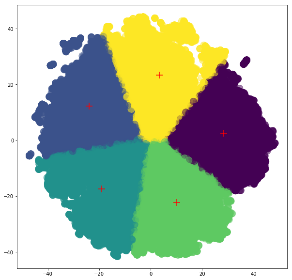
    


Коэффициент силуэта низок. Так же, визуально, разделение между кластерами весьма условно. Тем не менее, имеет смысл добавить данные. Полезность будет оценена позже.


```python
# Добавление значений во вспомогательный DataFrame
for_processing['txt_cluster'] = y_pred+np.ones(y_pred.shape[0])
for_processing.sample(3)
```


<div>
<style scoped>
    .dataframe tbody tr th:only-of-type {
        vertical-align: middle;
    }

    .dataframe tbody tr th {
        vertical-align: top;
    }

    .dataframe thead th {
        text-align: right;
    }
</style>
<table border="1" class="dataframe">
  <thead>
    <tr style="text-align: right;">
      <th></th>
      <th>ID_TA</th>
      <th>box_vec</th>
      <th>txt_cluster</th>
    </tr>
  </thead>
  <tbody>
    <tr>
      <th>26378</th>
      <td>d695014</td>
      <td>[0.8300892, -0.015936524, -0.024798453, 0.8901...</td>
      <td>2.0</td>
    </tr>
    <tr>
      <th>31358</th>
      <td>d7123768</td>
      <td>[2.4480796, 0.18148535, 0.8765771, 1.1748351, ...</td>
      <td>3.0</td>
    </tr>
    <tr>
      <th>37179</th>
      <td>d8285985</td>
      <td>[1.7435855, -0.42680076, 0.208268, 0.65267366,...</td>
      <td>3.0</td>
    </tr>
  </tbody>
</table>
</div>


```python
# Удаление дубликатов
for_processing.drop_duplicates('ID_TA', inplace = True)
```


```python
# Добавление кластера к основным данным
data = pd.merge(data,for_processing.drop('box_vec',axis = 1), on='ID_TA', how='outer')
data.txt_cluster.fillna(0, inplace=True)

# Длинна коментариев
data['txt_length'] = data.wordbox.apply(lambda x: len(x))

# Удаление вспомогательных признаков
data.drop(['wordbox','box_vec','help'], axis=1, inplace=True)

data.sample(3)
```


<div>
<style scoped>
    .dataframe tbody tr th:only-of-type {
        vertical-align: middle;
    }

    .dataframe tbody tr th {
        vertical-align: top;
    }

    .dataframe thead th {
        text-align: right;
    }
</style>
<table border="1" class="dataframe">
  <thead>
    <tr style="text-align: right;">
      <th></th>
      <th>Restaurant_id</th>
      <th>City</th>
      <th>Cuisine Style</th>
      <th>Ranking</th>
      <th>Rating</th>
      <th>Price Range</th>
      <th>Number of Reviews</th>
      <th>ID_TA</th>
      <th>train</th>
      <th>cuisine_nan</th>
      <th>cuisine_amount</th>
      <th>p_range_nan</th>
      <th>rvws_amount</th>
      <th>rvws_time_span</th>
      <th>rvws_latest</th>
      <th>txt_cluster</th>
      <th>txt_length</th>
    </tr>
  </thead>
  <tbody>
    <tr>
      <th>28248</th>
      <td>id_674</td>
      <td>Bratislava</td>
      <td>[Pizza, Pub]</td>
      <td>675.0</td>
      <td>3.5</td>
      <td>1.0</td>
      <td>8.0</td>
      <td>d8554969</td>
      <td>1</td>
      <td>0</td>
      <td>2</td>
      <td>0</td>
      <td>1</td>
      <td>0.0</td>
      <td>1.491178e+09</td>
      <td>4.0</td>
      <td>9</td>
    </tr>
    <tr>
      <th>13993</th>
      <td>id_9740</td>
      <td>London</td>
      <td>NaN</td>
      <td>9749.0</td>
      <td>4.5</td>
      <td>NaN</td>
      <td>5.0</td>
      <td>d11965269</td>
      <td>1</td>
      <td>1</td>
      <td>0</td>
      <td>1</td>
      <td>2</td>
      <td>6652800.0</td>
      <td>1.502323e+09</td>
      <td>4.0</td>
      <td>5</td>
    </tr>
    <tr>
      <th>32574</th>
      <td>id_6326</td>
      <td>London</td>
      <td>[Bar, British]</td>
      <td>6335.0</td>
      <td>4.0</td>
      <td>2.0</td>
      <td>60.0</td>
      <td>d3574046</td>
      <td>1</td>
      <td>0</td>
      <td>2</td>
      <td>0</td>
      <td>2</td>
      <td>7862400.0</td>
      <td>1.502237e+09</td>
      <td>3.0</td>
      <td>10</td>
    </tr>
  </tbody>
</table>
</div>


## 5. Обработка ID_TA / URL_TA

- В данных имеется ссылка на страницу для каждого ресторана. С одной стороны, актуальные рейтинги могут восприниматься как утечка данных. С другой стороны, ссылки были предоставлены и странно было бы ими не воспользоваться.

- Так как, TripAdvisor неохотно предоставляет доступ к API, ссылки были обработаны через HTML запросы к сайту. По скольку, данный процесс занимает довольно много времени, обработка была проведена вне этого ноутбука.

- Ссылка на ноутбук обработки:
https://github.com/blinnikov-ae/skillfactory_rds/blob/master/module_3/TripAdvisor_actual_rating_april_2021.ipynb


```python
# Загрузка результатов обработки
actual_ratings = pd.read_csv('/kaggle/input/ta-ratings-04-2021/TA_ratings_04_2021.csv')
actual_ratings.sample(3)
```


<div>
<style scoped>
    .dataframe tbody tr th:only-of-type {
        vertical-align: middle;
    }

    .dataframe tbody tr th {
        vertical-align: top;
    }

    .dataframe thead th {
        text-align: right;
    }
</style>
<table border="1" class="dataframe">
  <thead>
    <tr style="text-align: right;">
      <th></th>
      <th>ID_TA</th>
      <th>current_rating</th>
    </tr>
  </thead>
  <tbody>
    <tr>
      <th>26330</th>
      <td>d7621857</td>
      <td>4.5</td>
    </tr>
    <tr>
      <th>37709</th>
      <td>d6090536</td>
      <td>3.5</td>
    </tr>
    <tr>
      <th>49779</th>
      <td>d2720515</td>
      <td>4.0</td>
    </tr>
  </tbody>
</table>
</div>


```python
# Проверка на дубликаты
actual_ratings.ID_TA.duplicated().sum()
```


    0


```python
# Добавление кластера к основным данным
data = pd.merge(data,actual_ratings, on='ID_TA', how='outer')
data.drop('ID_TA', axis=1, inplace=True)

# Пометка данных имеющих пропуски
data['cur_rate_nan'] = pd.isna(data['current_rating']).astype('uint8')

data.sample(3)
```


<div>
<style scoped>
    .dataframe tbody tr th:only-of-type {
        vertical-align: middle;
    }

    .dataframe tbody tr th {
        vertical-align: top;
    }

    .dataframe thead th {
        text-align: right;
    }
</style>
<table border="1" class="dataframe">
  <thead>
    <tr style="text-align: right;">
      <th></th>
      <th>Restaurant_id</th>
      <th>City</th>
      <th>Cuisine Style</th>
      <th>Ranking</th>
      <th>Rating</th>
      <th>Price Range</th>
      <th>Number of Reviews</th>
      <th>train</th>
      <th>cuisine_nan</th>
      <th>cuisine_amount</th>
      <th>p_range_nan</th>
      <th>rvws_amount</th>
      <th>rvws_time_span</th>
      <th>rvws_latest</th>
      <th>txt_cluster</th>
      <th>txt_length</th>
      <th>current_rating</th>
      <th>cur_rate_nan</th>
    </tr>
  </thead>
  <tbody>
    <tr>
      <th>14530</th>
      <td>id_5171</td>
      <td>Madrid</td>
      <td>[Mediterranean, Vegetarian, Friendly]</td>
      <td>5174.0</td>
      <td>3.5</td>
      <td>1.0</td>
      <td>42.0</td>
      <td>1</td>
      <td>0</td>
      <td>3</td>
      <td>0</td>
      <td>2</td>
      <td>59616000.0</td>
      <td>1.506989e+09</td>
      <td>4.0</td>
      <td>10</td>
      <td>3.5</td>
      <td>0</td>
    </tr>
    <tr>
      <th>16201</th>
      <td>id_4357</td>
      <td>Madrid</td>
      <td>[Spanish]</td>
      <td>4359.0</td>
      <td>4.0</td>
      <td>NaN</td>
      <td>15.0</td>
      <td>1</td>
      <td>0</td>
      <td>1</td>
      <td>1</td>
      <td>0</td>
      <td>0.0</td>
      <td>0.000000e+00</td>
      <td>0.0</td>
      <td>0</td>
      <td>3.5</td>
      <td>0</td>
    </tr>
    <tr>
      <th>24068</th>
      <td>id_5115</td>
      <td>Paris</td>
      <td>[Vegetarian, Friendly]</td>
      <td>5116.0</td>
      <td>4.0</td>
      <td>1.0</td>
      <td>37.0</td>
      <td>1</td>
      <td>0</td>
      <td>2</td>
      <td>0</td>
      <td>2</td>
      <td>19180800.0</td>
      <td>1.513382e+09</td>
      <td>1.0</td>
      <td>8</td>
      <td>4.0</td>
      <td>0</td>
    </tr>
  </tbody>
</table>
</div>


## Итог
Две текстовые переменные (City, Cuisine Style) могут быть перекодированы в dummy-переменные.  Имеет смысл отдельно проверить полезность Cuisine Style, т.к. переменная очень грамоздкая. Остальные переменные в числовом формате.


```python
# Разбиваем признаки по группам
cat_cols = ['City', 'Price Range','txt_cluster']
num_cols = ['Ranking', 'Number of Reviews', 'cuisine_amount', 
            'rvws_amount', 'rvws_time_span', 'rvws_latest', 
            'txt_length', 'current_rating']
bin_cols = ['cuisine_nan', 'p_range_nan', 'cur_rate_nan']

# Проверка, что вошли все колонки, кроме 'train', 'Rating', 'Cuisine Style'
len(cat_cols) + len(num_cols) + len(bin_cols) - len(data.columns) + 3
```


    -1


# Наивная модель


```python
# Функция возвращает среднюю ошибку для данных и модели
def MAE(X, y, model):
    X_train, X_test, y_train, y_test = train_test_split(X, y, test_size=0.20, random_state = RS)
    
    model.fit(X_train, y_train)
    y_pred = model.predict(X_test)
    
    return mean_absolute_error(y_test, y_pred)
```


```python
results = {}
```


```python
# Возьмем данные без признаков с пропусками
naive = data[data.train==1].drop(['train','Restaurant_id'],axis=1)
naive = naive.dropna(axis=1)
naive.sample(3)
```


<div>
<style scoped>
    .dataframe tbody tr th:only-of-type {
        vertical-align: middle;
    }

    .dataframe tbody tr th {
        vertical-align: top;
    }

    .dataframe thead th {
        text-align: right;
    }
</style>
<table border="1" class="dataframe">
  <thead>
    <tr style="text-align: right;">
      <th></th>
      <th>City</th>
      <th>Ranking</th>
      <th>Rating</th>
      <th>cuisine_nan</th>
      <th>cuisine_amount</th>
      <th>p_range_nan</th>
      <th>rvws_amount</th>
      <th>rvws_time_span</th>
      <th>rvws_latest</th>
      <th>txt_cluster</th>
      <th>txt_length</th>
      <th>cur_rate_nan</th>
    </tr>
  </thead>
  <tbody>
    <tr>
      <th>17718</th>
      <td>Paris</td>
      <td>10014.0</td>
      <td>3.0</td>
      <td>0</td>
      <td>3</td>
      <td>0</td>
      <td>2</td>
      <td>32227200.0</td>
      <td>1.492301e+09</td>
      <td>3.0</td>
      <td>12</td>
      <td>1</td>
    </tr>
    <tr>
      <th>1086</th>
      <td>London</td>
      <td>7096.0</td>
      <td>4.0</td>
      <td>0</td>
      <td>5</td>
      <td>0</td>
      <td>2</td>
      <td>8985600.0</td>
      <td>1.511222e+09</td>
      <td>2.0</td>
      <td>10</td>
      <td>0</td>
    </tr>
    <tr>
      <th>36768</th>
      <td>Dublin</td>
      <td>455.0</td>
      <td>4.0</td>
      <td>0</td>
      <td>11</td>
      <td>0</td>
      <td>2</td>
      <td>3542400.0</td>
      <td>1.514765e+09</td>
      <td>5.0</td>
      <td>7</td>
      <td>0</td>
    </tr>
  </tbody>
</table>
</div>


```python
# Обработка категориальных признаков
naive = pd.get_dummies(naive, columns = ['City', 'txt_cluster'], prefix=None, dummy_na=False)
```


```python
# Для оценки будем использовать RandomForestRegressor
results['naive'] = MAE(X=naive.drop('Rating', axis = 1), 
    y=naive.Rating, model=RandomForestRegressor(random_state=RS))
print('MAE:\t',np.round(results['naive'], 2))
```

    /opt/conda/lib/python3.6/site-packages/sklearn/ensemble/forest.py:245: FutureWarning: The default value of n_estimators will change from 10 in version 0.20 to 100 in 0.22.
      "10 in version 0.20 to 100 in 0.22.", FutureWarning)


    MAE:	 0.28


# Пропуски в данных

## 1.  Заполнение нулями


```python
zeros = data[data.train==1].drop(['train','Restaurant_id'],axis=1)
zeros = zeros.fillna(0)
zeros.sample(3)
```


<div>
<style scoped>
    .dataframe tbody tr th:only-of-type {
        vertical-align: middle;
    }

    .dataframe tbody tr th {
        vertical-align: top;
    }

    .dataframe thead th {
        text-align: right;
    }
</style>
<table border="1" class="dataframe">
  <thead>
    <tr style="text-align: right;">
      <th></th>
      <th>City</th>
      <th>Cuisine Style</th>
      <th>Ranking</th>
      <th>Rating</th>
      <th>Price Range</th>
      <th>Number of Reviews</th>
      <th>cuisine_nan</th>
      <th>cuisine_amount</th>
      <th>p_range_nan</th>
      <th>rvws_amount</th>
      <th>rvws_time_span</th>
      <th>rvws_latest</th>
      <th>txt_cluster</th>
      <th>txt_length</th>
      <th>current_rating</th>
      <th>cur_rate_nan</th>
    </tr>
  </thead>
  <tbody>
    <tr>
      <th>33267</th>
      <td>Edinburgh</td>
      <td>[Bar, European, British, Scottish, Vegetarian,...</td>
      <td>223.0</td>
      <td>4.5</td>
      <td>2.0</td>
      <td>447.0</td>
      <td>0</td>
      <td>9</td>
      <td>0</td>
      <td>2</td>
      <td>1296000.0</td>
      <td>1.515197e+09</td>
      <td>5.0</td>
      <td>9</td>
      <td>4.5</td>
      <td>0</td>
    </tr>
    <tr>
      <th>26616</th>
      <td>London</td>
      <td>[Bar, British, Pub, Gastropub]</td>
      <td>6015.0</td>
      <td>4.5</td>
      <td>2.0</td>
      <td>47.0</td>
      <td>0</td>
      <td>4</td>
      <td>0</td>
      <td>2</td>
      <td>172800.0</td>
      <td>1.507248e+09</td>
      <td>5.0</td>
      <td>4</td>
      <td>4.0</td>
      <td>0</td>
    </tr>
    <tr>
      <th>12950</th>
      <td>Rome</td>
      <td>[Italian, Pizza, Mediterranean, Vegetarian, Fr...</td>
      <td>4259.0</td>
      <td>3.5</td>
      <td>2.0</td>
      <td>422.0</td>
      <td>0</td>
      <td>5</td>
      <td>0</td>
      <td>2</td>
      <td>5529600.0</td>
      <td>1.512259e+09</td>
      <td>5.0</td>
      <td>7</td>
      <td>0.0</td>
      <td>1</td>
    </tr>
  </tbody>
</table>
</div>


```python
# Обработка признаков
zeros = pd.get_dummies(zeros, columns = cat_cols, prefix=None, dummy_na=False)
zeros.drop('Cuisine Style', axis=1, inplace=True)

# Расчет метрики
results['zeros'] = MAE(X=zeros.drop('Rating', axis = 1), 
    y=zeros.Rating, model=RandomForestRegressor(random_state=RS))
print('MAE:\t',np.round(results['zeros'], 2))
```

    /opt/conda/lib/python3.6/site-packages/sklearn/ensemble/forest.py:245: FutureWarning: The default value of n_estimators will change from 10 in version 0.20 to 100 in 0.22.
      "10 in version 0.20 to 100 in 0.22.", FutureWarning)


    MAE:	 0.19


## 2.  Заполнение медианой


```python
median = data[data.train==1].drop(['train','Restaurant_id'],axis=1)
for col in ['Price Range','Number of Reviews','current_rating']:
    median[col].fillna(median[col].median(), inplace=True)
median.sample(3)
```


<div>
<style scoped>
    .dataframe tbody tr th:only-of-type {
        vertical-align: middle;
    }

    .dataframe tbody tr th {
        vertical-align: top;
    }

    .dataframe thead th {
        text-align: right;
    }
</style>
<table border="1" class="dataframe">
  <thead>
    <tr style="text-align: right;">
      <th></th>
      <th>City</th>
      <th>Cuisine Style</th>
      <th>Ranking</th>
      <th>Rating</th>
      <th>Price Range</th>
      <th>Number of Reviews</th>
      <th>cuisine_nan</th>
      <th>cuisine_amount</th>
      <th>p_range_nan</th>
      <th>rvws_amount</th>
      <th>rvws_time_span</th>
      <th>rvws_latest</th>
      <th>txt_cluster</th>
      <th>txt_length</th>
      <th>current_rating</th>
      <th>cur_rate_nan</th>
    </tr>
  </thead>
  <tbody>
    <tr>
      <th>7574</th>
      <td>Paris</td>
      <td>NaN</td>
      <td>6760.0</td>
      <td>4.0</td>
      <td>2.0</td>
      <td>37.0</td>
      <td>1</td>
      <td>0</td>
      <td>1</td>
      <td>2</td>
      <td>11577600.0</td>
      <td>1.486080e+09</td>
      <td>1.0</td>
      <td>8</td>
      <td>3.5</td>
      <td>0</td>
    </tr>
    <tr>
      <th>28940</th>
      <td>Vienna</td>
      <td>NaN</td>
      <td>1160.0</td>
      <td>4.5</td>
      <td>2.0</td>
      <td>22.0</td>
      <td>1</td>
      <td>0</td>
      <td>1</td>
      <td>2</td>
      <td>5616000.0</td>
      <td>1.500854e+09</td>
      <td>4.0</td>
      <td>7</td>
      <td>4.5</td>
      <td>0</td>
    </tr>
    <tr>
      <th>3803</th>
      <td>Edinburgh</td>
      <td>[Seafood, European, British, Soups, Scottish, ...</td>
      <td>288.0</td>
      <td>4.0</td>
      <td>2.0</td>
      <td>1149.0</td>
      <td>0</td>
      <td>10</td>
      <td>0</td>
      <td>2</td>
      <td>864000.0</td>
      <td>1.515542e+09</td>
      <td>1.0</td>
      <td>9</td>
      <td>4.0</td>
      <td>0</td>
    </tr>
  </tbody>
</table>
</div>


```python
# Обработка признаков
median = pd.get_dummies(median, columns = cat_cols, prefix=None, dummy_na=False)
median.drop('Cuisine Style', axis=1, inplace=True)

# Расчет метрики
results['median'] = MAE(X=median.drop('Rating', axis = 1), 
    y=median.Rating, model=RandomForestRegressor(random_state=RS))
print('MAE:\t',np.round(results['median'], 2))
```

    /opt/conda/lib/python3.6/site-packages/sklearn/ensemble/forest.py:245: FutureWarning: The default value of n_estimators will change from 10 in version 0.20 to 100 in 0.22.
      "10 in version 0.20 to 100 in 0.22.", FutureWarning)


    MAE:	 0.19


## 3.  Заполнение самым частым значением


```python
frequent = data[data.train==1].drop(['train','Restaurant_id'],axis=1)
for col in ['Price Range','Number of Reviews','current_rating']:
    frequent[col].fillna(frequent[col].value_counts().index[0], inplace=True)
frequent.sample(3)
```


<div>
<style scoped>
    .dataframe tbody tr th:only-of-type {
        vertical-align: middle;
    }

    .dataframe tbody tr th {
        vertical-align: top;
    }

    .dataframe thead th {
        text-align: right;
    }
</style>
<table border="1" class="dataframe">
  <thead>
    <tr style="text-align: right;">
      <th></th>
      <th>City</th>
      <th>Cuisine Style</th>
      <th>Ranking</th>
      <th>Rating</th>
      <th>Price Range</th>
      <th>Number of Reviews</th>
      <th>cuisine_nan</th>
      <th>cuisine_amount</th>
      <th>p_range_nan</th>
      <th>rvws_amount</th>
      <th>rvws_time_span</th>
      <th>rvws_latest</th>
      <th>txt_cluster</th>
      <th>txt_length</th>
      <th>current_rating</th>
      <th>cur_rate_nan</th>
    </tr>
  </thead>
  <tbody>
    <tr>
      <th>20097</th>
      <td>Lyon</td>
      <td>[Japanese]</td>
      <td>2270.0</td>
      <td>3.0</td>
      <td>2.0</td>
      <td>16.0</td>
      <td>0</td>
      <td>1</td>
      <td>1</td>
      <td>0</td>
      <td>0.0</td>
      <td>0.000000e+00</td>
      <td>0.0</td>
      <td>0</td>
      <td>3.0</td>
      <td>0</td>
    </tr>
    <tr>
      <th>23888</th>
      <td>Milan</td>
      <td>NaN</td>
      <td>3757.0</td>
      <td>4.0</td>
      <td>2.0</td>
      <td>8.0</td>
      <td>1</td>
      <td>0</td>
      <td>1</td>
      <td>0</td>
      <td>0.0</td>
      <td>0.000000e+00</td>
      <td>0.0</td>
      <td>0</td>
      <td>4.0</td>
      <td>0</td>
    </tr>
    <tr>
      <th>7709</th>
      <td>Krakow</td>
      <td>[Italian, Pizza, European, Vegetarian, Friendl...</td>
      <td>99.0</td>
      <td>4.5</td>
      <td>2.0</td>
      <td>523.0</td>
      <td>0</td>
      <td>7</td>
      <td>0</td>
      <td>2</td>
      <td>864000.0</td>
      <td>1.512778e+09</td>
      <td>1.0</td>
      <td>7</td>
      <td>4.5</td>
      <td>0</td>
    </tr>
  </tbody>
</table>
</div>


```python
# Обработка признаков
frequent = pd.get_dummies(frequent, columns = cat_cols, prefix=None, dummy_na=False)
frequent.drop('Cuisine Style', axis=1, inplace=True)

# Расчет метрики
results['frequent'] = MAE(X=frequent.drop('Rating', axis = 1), 
    y=frequent.Rating, model=RandomForestRegressor(random_state=RS))
print('MAE:\t',np.round(results['frequent'], 2))
```

    /opt/conda/lib/python3.6/site-packages/sklearn/ensemble/forest.py:245: FutureWarning: The default value of n_estimators will change from 10 in version 0.20 to 100 in 0.22.
      "10 in version 0.20 to 100 in 0.22.", FutureWarning)


    MAE:	 0.19


```python
plt.figure(figsize=(15, 5))
ax = sns.lineplot(x=[x for x in range(len(results.values()))], y=list(results.values()), marker='o')
ax.set(ylabel='MAE', xlabel='iter')
plt.show()

for key, value in results.items():
    print('{}: {}'.format(key, np.round(value, 4)))
```


    

    


    naive: 0.2828
    zeros: 0.1852
    median: 0.1875
    frequent: 0.1868


## Вывод

Заполнение медианным или самым частым значениями не дают прибавки в точности модели. Это можно объяснить тем, что '0' дополнительно помогает дереву решений отделять примеры с пропусками. В любом случае, не имеет смысл заполнять пропуски по средствам доп. моделирования и можно ограничиться заполнением нулями.


```python
data = data.fillna(0)
data.sample(3)
```


<div>
<style scoped>
    .dataframe tbody tr th:only-of-type {
        vertical-align: middle;
    }

    .dataframe tbody tr th {
        vertical-align: top;
    }

    .dataframe thead th {
        text-align: right;
    }
</style>
<table border="1" class="dataframe">
  <thead>
    <tr style="text-align: right;">
      <th></th>
      <th>Restaurant_id</th>
      <th>City</th>
      <th>Cuisine Style</th>
      <th>Ranking</th>
      <th>Rating</th>
      <th>Price Range</th>
      <th>Number of Reviews</th>
      <th>train</th>
      <th>cuisine_nan</th>
      <th>cuisine_amount</th>
      <th>p_range_nan</th>
      <th>rvws_amount</th>
      <th>rvws_time_span</th>
      <th>rvws_latest</th>
      <th>txt_cluster</th>
      <th>txt_length</th>
      <th>current_rating</th>
      <th>cur_rate_nan</th>
    </tr>
  </thead>
  <tbody>
    <tr>
      <th>10907</th>
      <td>id_1840</td>
      <td>Lisbon</td>
      <td>0</td>
      <td>1843.0</td>
      <td>5.0</td>
      <td>0.0</td>
      <td>3.0</td>
      <td>1</td>
      <td>1</td>
      <td>0</td>
      <td>1</td>
      <td>1</td>
      <td>0.0</td>
      <td>1.487549e+09</td>
      <td>5.0</td>
      <td>3</td>
      <td>4.5</td>
      <td>0</td>
    </tr>
    <tr>
      <th>21921</th>
      <td>id_3904</td>
      <td>Berlin</td>
      <td>[Wine, Bar, Vegetarian, Friendly]</td>
      <td>3906.0</td>
      <td>4.0</td>
      <td>1.0</td>
      <td>110.0</td>
      <td>1</td>
      <td>0</td>
      <td>4</td>
      <td>0</td>
      <td>2</td>
      <td>26179200.0</td>
      <td>1.511309e+09</td>
      <td>1.0</td>
      <td>9</td>
      <td>3.5</td>
      <td>0</td>
    </tr>
    <tr>
      <th>37747</th>
      <td>id_947</td>
      <td>Lyon</td>
      <td>[Italian, Pizza]</td>
      <td>948.0</td>
      <td>4.0</td>
      <td>2.0</td>
      <td>92.0</td>
      <td>1</td>
      <td>0</td>
      <td>2</td>
      <td>0</td>
      <td>0</td>
      <td>0.0</td>
      <td>0.000000e+00</td>
      <td>0.0</td>
      <td>0</td>
      <td>0.0</td>
      <td>1</td>
    </tr>
  </tbody>
</table>
</div>


# EDA

## Бинарные данные


```python
#Функция, проверяющая наличае статистически значимых различий между вариациями признака
def get_stat_dif(df, col, target):
    variations=len(df[col].value_counts().index)
    indexes=[i for i in range (0,variations)]
    comb=list(combinations(indexes, 2))
    for c in comb:
        x = df[df[col] == df[col].value_counts().index[c[0]]][target]
        y = df[df[col] == df[col].value_counts().index[c[1]]][target]
        t_test = weightstats.ttest_ind(x, y, usevar='unequal')
        if t_test[1] <= 0.05/len(comb):
            return True
        else:
            return False
```


```python
# Функция выводит основную информацию и график признака
def sum_up_cat(df, col, target):
    print(col.upper())
    vc = df[col].value_counts()
    vc_p = df[col].value_counts(normalize=True)
    for i in vc.index:
        print('{} (%%):\t{}'.format(i, np.round(vc_p[i],2)))
        print('\t Среднее значение целевой:\t{}'.format(np.round(df[df[col] == i][target].mean(),2)))
    print('Cтатистически значимые различия:\t{}'.format(get_stat_dif(df, col, target)))
    plt.figure()
    sns.catplot(data = df,  x = col, kind = 'count', palette = 'viridis')
    plt.show()
```


```python
for column in bin_cols:
    sum_up_cat(data[data.train==1], column, 'Rating')
```

    CUISINE_NAN
    0 (%%):	0.77
    	 Среднее значение целевой:	4.01
    1 (%%):	0.23
    	 Среднее значение целевой:	3.95
    Cтатистически значимые различия:	True


    <Figure size 720x720 with 0 Axes>


    
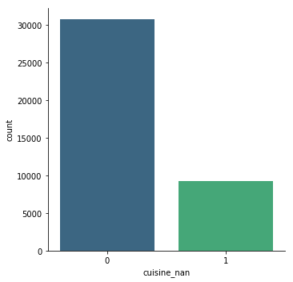
    


    P_RANGE_NAN
    0 (%%):	0.65
    	 Среднее значение целевой:	4.02
    1 (%%):	0.35
    	 Среднее значение целевой:	3.93
    Cтатистически значимые различия:	True


    <Figure size 720x720 with 0 Axes>


    
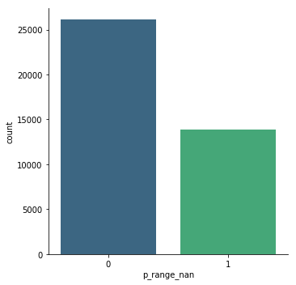
    


    CUR_RATE_NAN
    0 (%%):	0.88
    	 Среднее значение целевой:	3.99
    1 (%%):	0.12
    	 Среднее значение целевой:	4.0
    Cтатистически значимые различия:	False


    <Figure size 720x720 with 0 Axes>


    
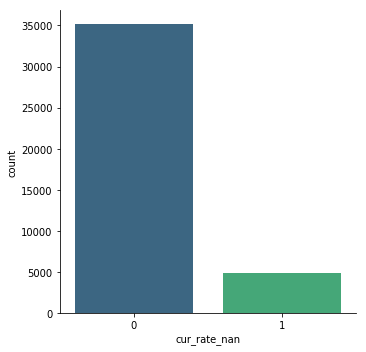
    


Бинарные признаки отражают пропущенные значения. Признак CUR_RATE_NAN не несет ценности, т.к. статистически значимые различия. Возможно, его стоит удалить.


```python
drop_CRN = data[data.train==1].drop(['train', 'Restaurant_id', 'cur_rate_nan'],axis=1)

# Обработка признаков
drop_CRN = pd.get_dummies(drop_CRN, columns = cat_cols, prefix=None, dummy_na=False)
drop_CRN.drop('Cuisine Style', axis=1, inplace=True)

# Расчет метрики
results['drop_CRN'] = MAE(X=drop_CRN.drop('Rating', axis = 1), 
    y=drop_CRN.Rating, model=RandomForestRegressor(random_state=RS))
print('MAE:\t',np.round(results['drop_CRN'], 2))
```

    /opt/conda/lib/python3.6/site-packages/sklearn/ensemble/forest.py:245: FutureWarning: The default value of n_estimators will change from 10 in version 0.20 to 100 in 0.22.
      "10 in version 0.20 to 100 in 0.22.", FutureWarning)


    MAE:	 0.19


```python
results
```


    {'naive': 0.2827788894447224,
     'zeros': 0.18515507753876934,
     'median': 0.187456228114057,
     'frequent': 0.18678714357178586,
     'drop_CRN': 0.18569909954977487}


```python
data.drop('cur_rate_nan', axis=1, inplace=True)
bin_cols.remove('cur_rate_nan')
```

## Категориальные данные


```python
for column in cat_cols:
    sum_up_cat(data[data.train==1], column, 'Rating')
```

    CITY
    London (%%):	0.14
    	 Среднее значение целевой:	3.96
    Paris (%%):	0.12
    	 Среднее значение целевой:	3.94
    Madrid (%%):	0.08
    	 Среднее значение целевой:	3.8
    Barcelona (%%):	0.07
    	 Среднее значение целевой:	3.96
    Berlin (%%):	0.05
    	 Среднее значение целевой:	4.12
    Milan (%%):	0.05
    	 Среднее значение целевой:	3.82
    Rome (%%):	0.05
    	 Среднее значение целевой:	4.23
    Prague (%%):	0.04
    	 Среднее значение целевой:	4.03
    Lisbon (%%):	0.03
    	 Среднее значение целевой:	4.05
    Vienna (%%):	0.03
    	 Среднее значение целевой:	4.08
    Amsterdam (%%):	0.03
    	 Среднее значение целевой:	4.13
    Brussels (%%):	0.03
    	 Среднее значение целевой:	3.91
    Hamburg (%%):	0.02
    	 Среднее значение целевой:	4.02
    Munich (%%):	0.02
    	 Среднее значение целевой:	4.05
    Lyon (%%):	0.02
    	 Среднее значение целевой:	3.95
    Stockholm (%%):	0.02
    	 Среднее значение целевой:	3.87
    Budapest (%%):	0.02
    	 Среднее значение целевой:	4.09
    Warsaw (%%):	0.02
    	 Среднее значение целевой:	4.09
    Dublin (%%):	0.02
    	 Среднее значение целевой:	4.06
    Copenhagen (%%):	0.02
    	 Среднее значение целевой:	3.99
    Athens (%%):	0.02
    	 Среднее значение целевой:	4.23
    Edinburgh (%%):	0.01
    	 Среднее значение целевой:	4.09
    Zurich (%%):	0.01
    	 Среднее значение целевой:	4.04
    Oporto (%%):	0.01
    	 Среднее значение целевой:	4.18
    Geneva (%%):	0.01
    	 Среднее значение целевой:	3.96
    Krakow (%%):	0.01
    	 Среднее значение целевой:	4.15
    Oslo (%%):	0.01
    	 Среднее значение целевой:	3.89
    Helsinki (%%):	0.01
    	 Среднее значение целевой:	3.95
    Bratislava (%%):	0.01
    	 Среднее значение целевой:	3.97
    Luxembourg (%%):	0.01
    	 Среднее значение целевой:	3.91
    Ljubljana (%%):	0.0
    	 Среднее значение целевой:	4.11
    Cтатистически значимые различия:	False


    <Figure size 720x720 with 0 Axes>


    
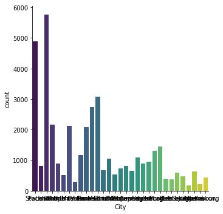
    


    PRICE RANGE
    2.0 (%%):	0.46
    	 Среднее значение целевой:	3.99
    0.0 (%%):	0.35
    	 Среднее значение целевой:	3.93
    1.0 (%%):	0.16
    	 Среднее значение целевой:	4.09
    3.0 (%%):	0.04
    	 Среднее значение целевой:	4.2
    Cтатистически значимые различия:	True


    <Figure size 720x720 with 0 Axes>


    
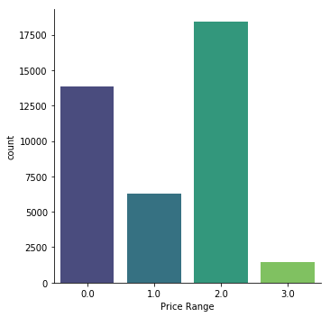
    


    TXT_CLUSTER
    5.0 (%%):	0.18
    	 Среднее значение целевой:	4.11
    4.0 (%%):	0.17
    	 Среднее значение целевой:	3.82
    1.0 (%%):	0.17
    	 Среднее значение целевой:	4.11
    0.0 (%%):	0.16
    	 Среднее значение целевой:	3.96
    2.0 (%%):	0.16
    	 Среднее значение целевой:	4.13
    3.0 (%%):	0.16
    	 Среднее значение целевой:	3.82
    Cтатистически значимые различия:	True


    <Figure size 720x720 with 0 Axes>


    
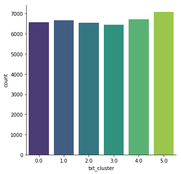
    


Не смотря на низкий коэффициент силуэта, TXT_CLUSTER представляет ценность. Средний рейтинг ниже для кластеров 2нх из 5. Для CITY статистически значимые различия не найдены. Признак может пригодиться для извлечения доп. данных. Тем не менее, стоит протестировать модель без него.


```python
drop_city = data[data.train==1].drop(['train', 'Restaurant_id', 'City'],axis=1)

# Обработка признаков
drop_city = pd.get_dummies(drop_city, columns = ['Price Range','txt_cluster'], prefix=None, dummy_na=False)
drop_city.drop('Cuisine Style', axis=1, inplace=True)

# Расчет метрики
results['drop_city'] = MAE(X=drop_city.drop('Rating', axis = 1), 
    y=drop_city.Rating, model=RandomForestRegressor(random_state=RS))
print('MAE:\t',np.round(results['drop_city'], 2))
```

    /opt/conda/lib/python3.6/site-packages/sklearn/ensemble/forest.py:245: FutureWarning: The default value of n_estimators will change from 10 in version 0.20 to 100 in 0.22.
      "10 in version 0.20 to 100 in 0.22.", FutureWarning)


    MAE:	 0.22


```python
results
```


    {'naive': 0.2827788894447224,
     'zeros': 0.18515507753876934,
     'median': 0.187456228114057,
     'frequent': 0.18678714357178586,
     'drop_CRN': 0.18569909954977487,
     'drop_city': 0.224146448224112}


## Числовые данные


```python
# Функция расчитывает кол-во выбросов по столбцам и их долю
def outbursts(df, col):
    Q25 = df[col].quantile(0.25)
    Q75 = df[col].quantile(0.75)
    IQR = Q75 - Q25
    lowest = Q25 - 1.5*IQR
    highest = Q75 + 1.5*IQR
    amount = df[(df[col] < lowest)|(df[col] > highest)].count()[0]
    ratio = amount/df.shape[0]
    return amount, ratio, lowest, highest
```


```python
#Функция выводит основную информацию и график признака
def sum_up_num(df, col, target):
    print(col.upper())
    print(df[col].describe()[1:])
    print('Кол-во выбросов: {} \t (%%: {})'.format(outbursts(df, col)[0], 
                                                   np.round(outbursts(df, col)[1]*100,2)))
    print()
    fig, axs = plt.subplots(figsize=(15, 5), ncols=2)
    sns.distplot(df[col], kde=True, ax=axs[0])
    sns.boxplot(data = df,  x = col, palette = 'viridis', ax=axs[1])
    plt.show()
```


```python
for column in num_cols:
    sum_up_num(data[data.train==1], column, 'Rating')
```

    RANKING
    mean     3676.497249
    std      3709.500590
    min         1.000000
    25%       973.000000
    50%      2284.000000
    75%      5261.000000
    max     16444.000000
    Name: Ranking, dtype: float64
    Кол-во выбросов: 2447 	 (%%: 6.12)
    


    
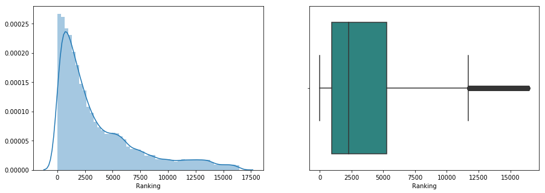
    


    NUMBER OF REVIEWS
    mean     116.890145
    std      287.785867
    min        0.000000
    25%        7.000000
    50%       28.000000
    75%      104.250000
    max     9660.000000
    Name: Number of Reviews, dtype: float64
    Кол-во выбросов: 4790 	 (%%: 11.98)
    


    
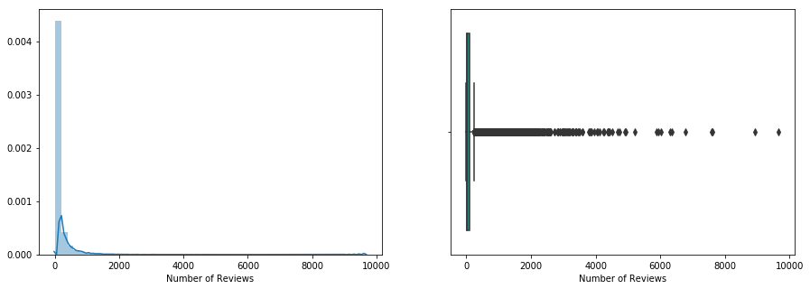
    


    CUISINE_AMOUNT
    mean     3.141396
    std      3.097334
    min      0.000000
    25%      1.000000
    50%      2.000000
    75%      5.000000
    max     27.000000
    Name: cuisine_amount, dtype: float64
    Кол-во выбросов: 468 	 (%%: 1.17)
    


    
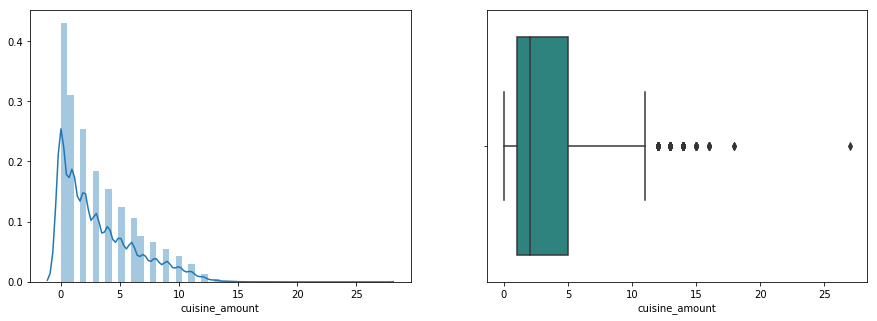
    


    RVWS_AMOUNT
    mean    1.562731
    std     0.754712
    min     0.000000
    25%     1.000000
    50%     2.000000
    75%     2.000000
    max     3.000000
    Name: rvws_amount, dtype: float64
    Кол-во выбросов: 0 	 (%%: 0.0)
    


    
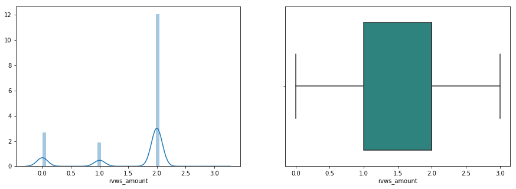
    


    RVWS_TIME_SPAN
    mean    8.868474e+06
    std     1.716046e+07
    min     0.000000e+00
    25%     0.000000e+00
    50%     2.419200e+06
    75%     1.036800e+07
    max     2.770848e+08
    Name: rvws_time_span, dtype: float64
    Кол-во выбросов: 3579 	 (%%: 8.95)
    


    
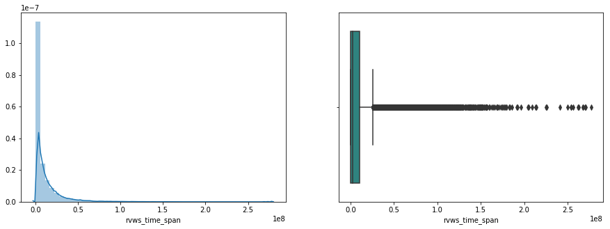
    


    RVWS_LATEST
    mean    1.252913e+09
    std     5.510430e+08
    min     0.000000e+00
    25%     1.461629e+09
    50%     1.502064e+09
    75%     1.511741e+09
    max     1.519603e+09
    Name: rvws_latest, dtype: float64
    Кол-во выбросов: 7029 	 (%%: 17.58)
    


    
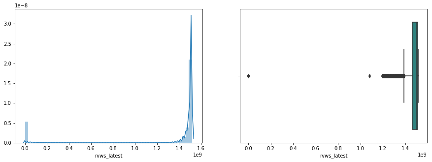
    


    TXT_LENGTH
    mean     6.036468
    std      3.773797
    min      0.000000
    25%      4.000000
    50%      6.000000
    75%      9.000000
    max     18.000000
    Name: txt_length, dtype: float64
    Кол-во выбросов: 30 	 (%%: 0.08)
    


    
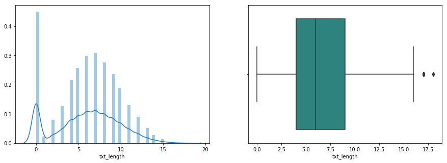
    


    CURRENT_RATING
    mean    3.472424
    std     1.421111
    min     0.000000
    25%     3.500000
    50%     4.000000
    75%     4.500000
    max     5.000000
    Name: current_rating, dtype: float64
    Кол-во выбросов: 5074 	 (%%: 12.69)
    


    
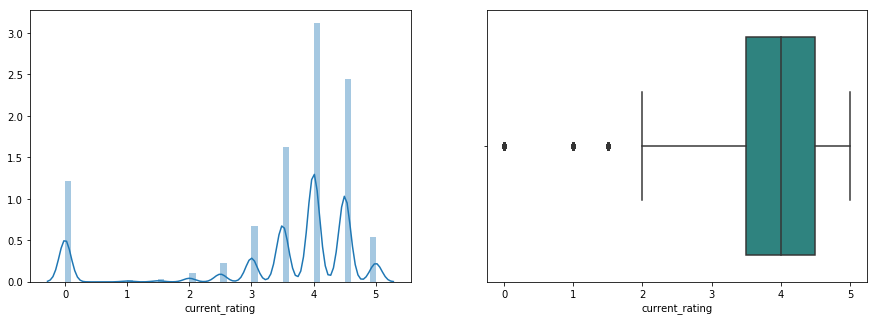
    


```python
# Корреляционная матрица
f, ax = plt.subplots(figsize=(15, 12))
sns.heatmap(data[data.train==1][num_cols].corr(), vmin=-1, vmax=1, annot=True, linewidths=.5, cmap='viridis')
```


    <matplotlib.axes._subplots.AxesSubplot at 0x7f14a1706f28>


    
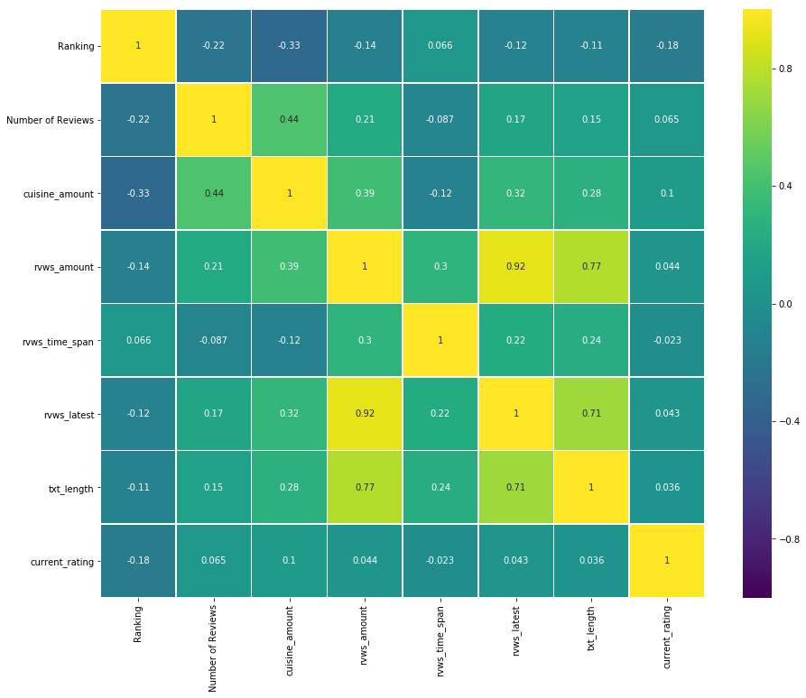
    


Для числовых признаков, имеется довольно много выбросов. Тем не менее, выбросы не выглядят аномальными. Среди признаков, извлеченных из Reviews, наблюдается высокая корреляция. Может иметь смысл избавиться от rvws_latest, как признака для которого выбросы наиболее велики.

Так же, необходимо отдельно рассмотреть Ranking, т.к. признак отражает ранг в конкретном городе.


```python
drop_RL = data[data.train==1].drop(['train','Restaurant_id', 'rvws_latest'],axis=1)

# Обработка признаков
drop_RL = pd.get_dummies(drop_RL, columns = cat_cols, prefix=None, dummy_na=False)
drop_RL.drop('Cuisine Style', axis=1, inplace=True)

# Расчет метрики
results['drop_RL'] = MAE(X=drop_RL.drop('Rating', axis = 1), 
    y=drop_RL.Rating, model=RandomForestRegressor(random_state=RS))
print('MAE:\t',np.round(results['drop_RL'], 2))
```

    /opt/conda/lib/python3.6/site-packages/sklearn/ensemble/forest.py:245: FutureWarning: The default value of n_estimators will change from 10 in version 0.20 to 100 in 0.22.
      "10 in version 0.20 to 100 in 0.22.", FutureWarning)


    MAE:	 0.19


```python
results
```


    {'naive': 0.2827788894447224,
     'zeros': 0.18515507753876934,
     'median': 0.187456228114057,
     'frequent': 0.18678714357178586,
     'drop_CRN': 0.18569909954977487,
     'drop_city': 0.224146448224112,
     'drop_RL': 0.1853114057028514}


```python
plt.figure(figsize=(15, 5))
for city in data.City.unique()[:5]:
    sns.distplot(data[data.City==city]['Ranking'], kde=True, label=city)
plt.legend(loc='lower right')
plt.show()
```


    
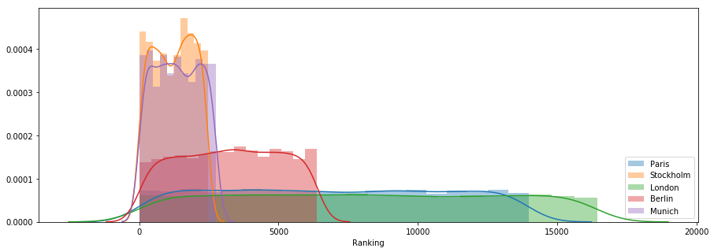
    


Без rvws_latest, MAE чуть выше. Имеет смысл стандартизировать Ranking, относительно города. Стандартизация будет выполнена позже, при извлечении доп. информации из City.


```python
# Создание словаря с максимальным значением Ranking для города
city_max = {}
for city in list(data.City.unique()):
    city_max[city] = data[data.City == city].Ranking.max()
```


```python
# Функция возражает произведение значений Ranking и максисального значения Ranking по городу
def std_rank(row):
    return row.Ranking/city_max[row.City]
```


```python
# Параметр ranking_norm стандартизированный Ranking
data['city_ranking'] = data.apply(std_rank, axis = 1)
num_cols.append('city_ranking')
sum_up_num(data[data.train==1], 'city_ranking', 'Rating')
```

    CITY_RANKING
    mean    0.498804
    std     0.287685
    min     0.000061
    25%     0.249571
    50%     0.497555
    75%     0.747571
    max     1.000000
    Name: city_ranking, dtype: float64
    Кол-во выбросов: 0 	 (%%: 0.0)
    


    
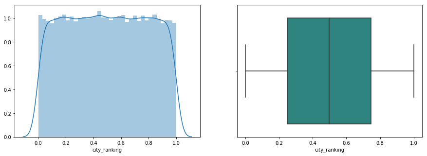
    


```python
# Корреляционная матрица
f, ax = plt.subplots(figsize=(15, 12))
sns.heatmap(data[data.train==1][num_cols].corr(), vmin=-1, vmax=1, annot=True, linewidths=.5, cmap='viridis')
```


    <matplotlib.axes._subplots.AxesSubplot at 0x7f14a386fa90>


    
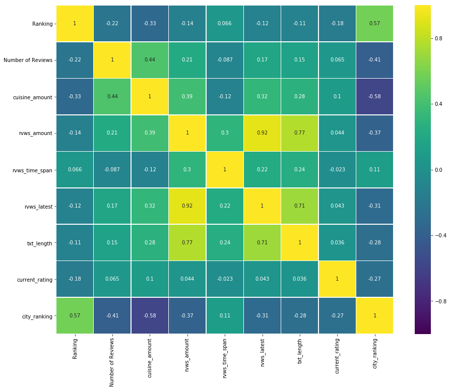
    


```python
city_r = data[data.train==1].drop(['train','Restaurant_id'],axis=1)

# Обработка признаков
city_r = pd.get_dummies(city_r, columns = cat_cols, prefix=None, dummy_na=False)
city_r.drop('Cuisine Style', axis=1, inplace=True)

# Расчет метрики
results['city_r'] = MAE(X=city_r.drop('Rating', axis = 1), 
    y=city_r.Rating, model=RandomForestRegressor(random_state=RS))
print('MAE:\t',np.round(results['city_r'], 2))
```

    /opt/conda/lib/python3.6/site-packages/sklearn/ensemble/forest.py:245: FutureWarning: The default value of n_estimators will change from 10 in version 0.20 to 100 in 0.22.
      "10 in version 0.20 to 100 in 0.22.", FutureWarning)


    MAE:	 0.16


```python
results
```


    {'naive': 0.2827788894447224,
     'zeros': 0.18515507753876934,
     'median': 0.187456228114057,
     'frequent': 0.18678714357178586,
     'drop_CRN': 0.18569909954977487,
     'drop_city': 0.224146448224112,
     'drop_RL': 0.1853114057028514,
     'city_r': 0.1579227113556778}


## Cuisine Style


```python
# Функция возвращает 'Non_specified' для пустых занчений Cuisine Style
def filling_CS_nan(cuisine_style):
    if type(cuisine_style) == int:
        return ['Non_specified']
    else:
        return cuisine_style
```


```python
data['Cuisine Style'] = data['Cuisine Style'].apply(filling_CS_nan)
```


```python
data.head(3)
```


<div>
<style scoped>
    .dataframe tbody tr th:only-of-type {
        vertical-align: middle;
    }

    .dataframe tbody tr th {
        vertical-align: top;
    }

    .dataframe thead th {
        text-align: right;
    }
</style>
<table border="1" class="dataframe">
  <thead>
    <tr style="text-align: right;">
      <th></th>
      <th>Restaurant_id</th>
      <th>City</th>
      <th>Cuisine Style</th>
      <th>Ranking</th>
      <th>Rating</th>
      <th>Price Range</th>
      <th>Number of Reviews</th>
      <th>train</th>
      <th>cuisine_nan</th>
      <th>cuisine_amount</th>
      <th>p_range_nan</th>
      <th>rvws_amount</th>
      <th>rvws_time_span</th>
      <th>rvws_latest</th>
      <th>txt_cluster</th>
      <th>txt_length</th>
      <th>current_rating</th>
      <th>city_ranking</th>
    </tr>
  </thead>
  <tbody>
    <tr>
      <th>0</th>
      <td>id_5569</td>
      <td>Paris</td>
      <td>[European, French, International]</td>
      <td>5570.0</td>
      <td>3.5</td>
      <td>2.0</td>
      <td>194.0</td>
      <td>1</td>
      <td>0</td>
      <td>3</td>
      <td>0</td>
      <td>2</td>
      <td>3542400.0</td>
      <td>1.514678e+09</td>
      <td>3.0</td>
      <td>8</td>
      <td>3.5</td>
      <td>0.398255</td>
    </tr>
    <tr>
      <th>1</th>
      <td>id_1535</td>
      <td>Stockholm</td>
      <td>[Non_specified]</td>
      <td>1537.0</td>
      <td>4.0</td>
      <td>0.0</td>
      <td>10.0</td>
      <td>1</td>
      <td>1</td>
      <td>0</td>
      <td>1</td>
      <td>2</td>
      <td>33004800.0</td>
      <td>1.499299e+09</td>
      <td>2.0</td>
      <td>5</td>
      <td>4.0</td>
      <td>0.623782</td>
    </tr>
    <tr>
      <th>2</th>
      <td>id_352</td>
      <td>London</td>
      <td>[Japanese, Sushi, Asian, Grill, Vegetarian, Fr...</td>
      <td>353.0</td>
      <td>4.5</td>
      <td>3.0</td>
      <td>688.0</td>
      <td>1</td>
      <td>0</td>
      <td>11</td>
      <td>0</td>
      <td>2</td>
      <td>172800.0</td>
      <td>1.515370e+09</td>
      <td>4.0</td>
      <td>6</td>
      <td>4.5</td>
      <td>0.021467</td>
    </tr>
  </tbody>
</table>
</div>


```python
# Функция для заполнения категории Cuisine Style
def dummy_cuisine(cell):
    if item in cell:
        return 1
    return 0
```


```python
# Список уникальных значений Cuisine Style
all_cuisines = pd.Series(data['Cuisine Style'].sum()).unique()
```


```python
dummy_cs = data[data.train==1].drop(['train','Restaurant_id'],axis=1)

# Кодирование Cuisine Style
for item in all_cuisines:
    dummy_cs[item] = dummy_cs['Cuisine Style'].apply(dummy_cuisine)

# Обработка признаков
dummy_cs = pd.get_dummies(dummy_cs, columns = cat_cols, prefix=None, dummy_na=False)
dummy_cs.drop('Cuisine Style', axis=1, inplace=True)

# Расчет метрики
results['dummy_cs'] = MAE(X=dummy_cs.drop('Rating', axis = 1), 
    y=dummy_cs.Rating, model=RandomForestRegressor(random_state=RS))
print('MAE:\t',np.round(results['dummy_cs'], 2))
```

    /opt/conda/lib/python3.6/site-packages/sklearn/ensemble/forest.py:245: FutureWarning: The default value of n_estimators will change from 10 in version 0.20 to 100 in 0.22.
      "10 in version 0.20 to 100 in 0.22.", FutureWarning)


    MAE:	 0.16


```python
results
```


    {'naive': 0.2827788894447224,
     'zeros': 0.18515507753876934,
     'median': 0.187456228114057,
     'frequent': 0.18678714357178586,
     'drop_CRN': 0.18569909954977487,
     'drop_city': 0.224146448224112,
     'drop_RL': 0.1853114057028514,
     'city_r': 0.1579227113556778,
     'dummy_cs': 0.15786643321660826}


Добавление признака Cuisine Style дает лишь несущественное понижение MAE. Можно удалить признак.


```python
data.drop('Cuisine Style', axis=1, inplace=True)
```

## Вывод


```python
plt.figure(figsize=(15, 5))
ax = sns.lineplot(x=[x for x in range(len(results.values()))], y=list(results.values()), marker='o')
ax.set(ylabel='MAE', xlabel='iter')
plt.show()

for key, value in results.items():
    print('{}: {}'.format(key, np.round(value, 4)))
```


    
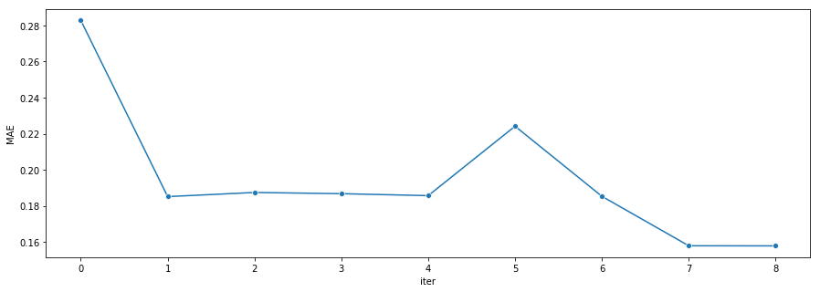
    


    naive: 0.2828
    zeros: 0.1852
    median: 0.1875
    frequent: 0.1868
    drop_CRN: 0.1857
    drop_city: 0.2241
    drop_RL: 0.1853
    city_r: 0.1579
    dummy_cs: 0.1579


В ходе анализа данных удалось выявить неинформативный признак. Cтандартизированный Ranking существенно улучшил модель. Cuisine Style был уален.

# Feature Engineering


```python
# Функция измеряет взаимную информацию для ряда переменных
def mi_reg(features, target):
    mi_scores = mutual_info_regression(features, target, random_state = RS)
    mi_scores = pd.Series(mi_scores, index=features.columns)
    return mi_scores
```


```python
# Расчет взаимной иформации
train = data[data.train==1].drop(['train', 'Restaurant_id', 'City'],axis=1)
features = train.drop('Rating', axis = 1)
target = train.Rating
mi_scores = mi_reg(features, target)
mi_scores = mi_scores.sort_values()
mi_scores.plot(kind = 'barh')
```


    <matplotlib.axes._subplots.AxesSubplot at 0x7f14a39744a8>


    
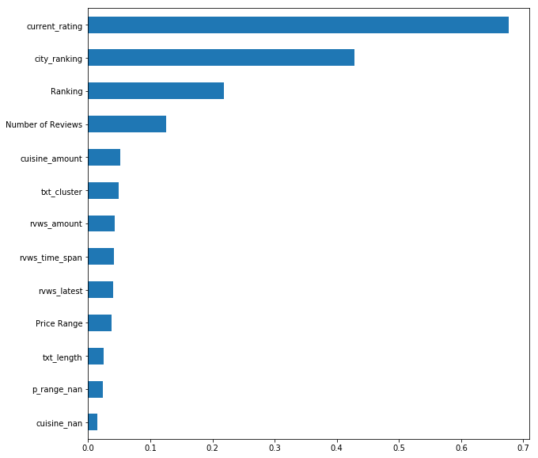
    


Наиболее информативными признаками являются, созданные при обработке, current_rating, city_ranking. Возможно, имеет смысл дополнительно кластеризировать данные на основе данных признаков.

Извлечение данных из Cuisine Style, Reviews и обозначение пропусков не дают ощутимой прибавки в полезной информации. Тем не менее, можно попробовать дополнительно извлечь информацию по городу.

## 1. Clustering


```python
# Визуализация отношения city_ranking и current_rating с учетом целевой Rating
sns.lmplot(data=data[data.train==1], 
                x='current_rating', y='city_ranking',
                hue='Rating', palette='viridis')
```


    <seaborn.axisgrid.FacetGrid at 0x7f14a38cfb70>


    

    


```python
# Кластеризация
x = StandardScaler().fit_transform(data[['current_rating','city_ranking']].values)
kmeans.fit(x)
y_pred = kmeans.labels_.astype(np.int)

print ("Коэффициент силуэта: %0.3f" % silhouette_score(x, y_pred, metric='euclidean'))

plt.rcParams['figure.figsize'] = 10, 10
plt.scatter(x[:, 0], x[:, 1], c=y_pred, s=200, alpha=.5)
plt.scatter(kmeans.cluster_centers_[:, 0], kmeans.cluster_centers_[:, 1], c='red', s=200, marker='+')
plt.show()
```

    Коэффициент силуэта: 0.480


    
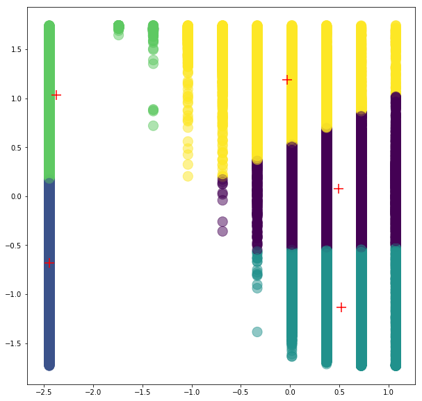
    


```python
data['rate_rank_cluster'] = y_pred
cat_cols.append('rate_rank_cluster')
```


```python
rr_cluster = data[data.train==1].drop(['train','Restaurant_id'],axis=1)

# Обработка признаков
rr_cluster = pd.get_dummies(rr_cluster, columns = cat_cols, prefix=None, dummy_na=False)

# Расчет метрики
results['rr_cluster'] = MAE(X=rr_cluster.drop('Rating', axis = 1), 
    y=rr_cluster.Rating, model=RandomForestRegressor(random_state=RS))
print('MAE:\t',np.round(results['rr_cluster'], 2))
```

    /opt/conda/lib/python3.6/site-packages/sklearn/ensemble/forest.py:245: FutureWarning: The default value of n_estimators will change from 10 in version 0.20 to 100 in 0.22.
      "10 in version 0.20 to 100 in 0.22.", FutureWarning)


    MAE:	 0.16


```python
results
```


    {'naive': 0.2827788894447224,
     'zeros': 0.18515507753876934,
     'median': 0.187456228114057,
     'frequent': 0.18678714357178586,
     'drop_CRN': 0.18569909954977487,
     'drop_city': 0.224146448224112,
     'drop_RL': 0.1853114057028514,
     'city_r': 0.1579227113556778,
     'dummy_cs': 0.15786643321660826,
     'rr_cluster': 0.15875437718859425}


Кластеризация ухудшила модель.


```python
data.drop('rate_rank_cluster', axis=1, inplace=True)
cat_cols.remove('rate_rank_cluster')
```

## 2. Доп. информация из City


```python
# Загрузка справочника городов
cities_stat = pd.read_csv('/kaggle/input/world-cities/worldcities.csv')
cities_stat.sample(3)
```


<div>
<style scoped>
    .dataframe tbody tr th:only-of-type {
        vertical-align: middle;
    }

    .dataframe tbody tr th {
        vertical-align: top;
    }

    .dataframe thead th {
        text-align: right;
    }
</style>
<table border="1" class="dataframe">
  <thead>
    <tr style="text-align: right;">
      <th></th>
      <th>city</th>
      <th>city_ascii</th>
      <th>lat</th>
      <th>lng</th>
      <th>country</th>
      <th>iso2</th>
      <th>iso3</th>
      <th>admin_name</th>
      <th>capital</th>
      <th>population</th>
      <th>id</th>
    </tr>
  </thead>
  <tbody>
    <tr>
      <th>9483</th>
      <td>Zelënodol’sk</td>
      <td>Zelenodol'sk</td>
      <td>55.8500</td>
      <td>48.5167</td>
      <td>Russia</td>
      <td>RU</td>
      <td>RUS</td>
      <td>Tatarstan</td>
      <td>NaN</td>
      <td>99491.0</td>
      <td>1643223486</td>
    </tr>
    <tr>
      <th>9116</th>
      <td>Žitorađa</td>
      <td>Zitorada</td>
      <td>43.1833</td>
      <td>21.7167</td>
      <td>Serbia</td>
      <td>RS</td>
      <td>SRB</td>
      <td>Žitorađa</td>
      <td>admin</td>
      <td>NaN</td>
      <td>1688262057</td>
    </tr>
    <tr>
      <th>19103</th>
      <td>Walker Mill</td>
      <td>Walker Mill</td>
      <td>38.8754</td>
      <td>-76.8862</td>
      <td>United States</td>
      <td>US</td>
      <td>USA</td>
      <td>Maryland</td>
      <td>NaN</td>
      <td>11780.0</td>
      <td>1840031499</td>
    </tr>
  </tbody>
</table>
</div>


```python
# Проверка есть ли все города в справочнике.
# В случае нескольких городов, взят самый крупный
for city in data.City.unique():
    cities = cities_stat[cities_stat.city_ascii == city]
    if cities.shape[0] == 0:
        print('"{}" отсутствует в cities_stat'.format(city))
```

    "Oporto" отсутствует в cities_stat


Oporto одно из двух названий португальского Porto.


```python
# Преобразование Oporto в Porto
data['City'] = data['City'].apply(lambda x: 'Porto' if x=='Oporto' else x)
```


```python
# Выбираем из справочника только необходимое
city_ids = []
for city in data.City.unique():
    cities = cities_stat[cities_stat.city_ascii == city]
    city_id = cities[cities.population == cities.population.max()].index[0]
    city_ids.append(city_id)


useful_stat = cities_stat.loc[city_ids][['city_ascii','lat','lng','country','population']]
useful_stat.rename(columns = {'city_ascii': 'City'}, inplace = True)
useful_stat.sample(3)
```


<div>
<style scoped>
    .dataframe tbody tr th:only-of-type {
        vertical-align: middle;
    }

    .dataframe tbody tr th {
        vertical-align: top;
    }

    .dataframe thead th {
        text-align: right;
    }
</style>
<table border="1" class="dataframe">
  <thead>
    <tr style="text-align: right;">
      <th></th>
      <th>City</th>
      <th>lat</th>
      <th>lng</th>
      <th>country</th>
      <th>population</th>
    </tr>
  </thead>
  <tbody>
    <tr>
      <th>741</th>
      <td>Helsinki</td>
      <td>60.1756</td>
      <td>24.9342</td>
      <td>Finland</td>
      <td>642045.0</td>
    </tr>
    <tr>
      <th>685</th>
      <td>Amsterdam</td>
      <td>52.3500</td>
      <td>4.9166</td>
      <td>Netherlands</td>
      <td>1031000.0</td>
    </tr>
    <tr>
      <th>1395</th>
      <td>Edinburgh</td>
      <td>55.9530</td>
      <td>-3.1890</td>
      <td>United Kingdom</td>
      <td>488050.0</td>
    </tr>
  </tbody>
</table>
</div>


```python
# Добавление данных
data = pd.merge(data,useful_stat, on='City', how='outer')
data.sample(3)
```


<div>
<style scoped>
    .dataframe tbody tr th:only-of-type {
        vertical-align: middle;
    }

    .dataframe tbody tr th {
        vertical-align: top;
    }

    .dataframe thead th {
        text-align: right;
    }
</style>
<table border="1" class="dataframe">
  <thead>
    <tr style="text-align: right;">
      <th></th>
      <th>Restaurant_id</th>
      <th>City</th>
      <th>Ranking</th>
      <th>Rating</th>
      <th>Price Range</th>
      <th>Number of Reviews</th>
      <th>train</th>
      <th>cuisine_nan</th>
      <th>cuisine_amount</th>
      <th>p_range_nan</th>
      <th>...</th>
      <th>rvws_time_span</th>
      <th>rvws_latest</th>
      <th>txt_cluster</th>
      <th>txt_length</th>
      <th>current_rating</th>
      <th>city_ranking</th>
      <th>lat</th>
      <th>lng</th>
      <th>country</th>
      <th>population</th>
    </tr>
  </thead>
  <tbody>
    <tr>
      <th>23652</th>
      <td>id_2799</td>
      <td>Rome</td>
      <td>2800.0</td>
      <td>4.0</td>
      <td>2.0</td>
      <td>519.0</td>
      <td>1</td>
      <td>0</td>
      <td>6</td>
      <td>0</td>
      <td>...</td>
      <td>26611200.0</td>
      <td>1.367885e+09</td>
      <td>4.0</td>
      <td>13</td>
      <td>3.5</td>
      <td>0.470746</td>
      <td>41.8931</td>
      <td>12.4828</td>
      <td>Italy</td>
      <td>2872800.0</td>
    </tr>
    <tr>
      <th>49192</th>
      <td>id_615</td>
      <td>Luxembourg</td>
      <td>616.0</td>
      <td>2.0</td>
      <td>0.0</td>
      <td>0.0</td>
      <td>1</td>
      <td>1</td>
      <td>0</td>
      <td>1</td>
      <td>...</td>
      <td>0.0</td>
      <td>0.000000e+00</td>
      <td>0.0</td>
      <td>0</td>
      <td>4.5</td>
      <td>0.991948</td>
      <td>49.6106</td>
      <td>6.1328</td>
      <td>Luxembourg</td>
      <td>122273.0</td>
    </tr>
    <tr>
      <th>3777</th>
      <td>id_79</td>
      <td>Paris</td>
      <td>80.0</td>
      <td>4.5</td>
      <td>2.0</td>
      <td>652.0</td>
      <td>1</td>
      <td>0</td>
      <td>10</td>
      <td>0</td>
      <td>...</td>
      <td>518400.0</td>
      <td>1.514506e+09</td>
      <td>2.0</td>
      <td>7</td>
      <td>4.5</td>
      <td>0.005720</td>
      <td>48.8566</td>
      <td>2.3522</td>
      <td>France</td>
      <td>11020000.0</td>
    </tr>
  </tbody>
</table>
<p>3 rows × 21 columns</p>
</div>


### 2.1. Country


```python
cat_cols.append('country')
```


```python
country = data[data.train==1].drop(['train','Restaurant_id'],axis=1)

# Обработка признаков
country = pd.get_dummies(country, columns = cat_cols, prefix=None, dummy_na=False)
country.drop(['lat','lng','population'],axis=1)

# Расчет метрики
results['country'] = MAE(X=country.drop('Rating', axis = 1), 
    y=country.Rating, model=RandomForestRegressor(random_state=RS))
print('MAE:\t',np.round(results['country'], 2))
```

    /opt/conda/lib/python3.6/site-packages/sklearn/ensemble/forest.py:245: FutureWarning: The default value of n_estimators will change from 10 in version 0.20 to 100 in 0.22.
      "10 in version 0.20 to 100 in 0.22.", FutureWarning)


    MAE:	 0.16


```python
results
```


    {'naive': 0.2827788894447224,
     'zeros': 0.18515507753876934,
     'median': 0.187456228114057,
     'frequent': 0.18678714357178586,
     'drop_CRN': 0.18569909954977487,
     'drop_city': 0.224146448224112,
     'drop_RL': 0.1853114057028514,
     'city_r': 0.1579227113556778,
     'dummy_cs': 0.15786643321660826,
     'rr_cluster': 0.15875437718859425,
     'country': 0.15514632316158075}


Признак улучшает результат модели

### 2.2. Координаты

Без использования платного Google API.

Карта выгружена с https://www.openstreetmap.org/ по координатам и добавлена как PNG-файл.


```python
# Границы координат
coor_box = ((data.lng.min(), data.lng.max(), 
             data.lat.min(), data.lat.max()))
coor_box
```


    (-9.1604, 24.9342, 37.9794, 60.1756)


```python
# Загрузка изображения карты
ta_map = plt.imread('/kaggle/input/tripadvisor-map/tripadvisor_map.png')
```


```python
# Визуализация
fig, ax = plt.subplots(figsize = (10,15))
ax.scatter(data.lng, data.lat, zorder=1, alpha= 1, c='b', s=20)
ax.set_title('Cities')
ax.set_xlim(coor_box[0],coor_box[1])
ax.set_ylim(coor_box[2],coor_box[3])
ax.imshow(ta_map, zorder=0, extent = coor_box, aspect= 'equal')
```


    <matplotlib.image.AxesImage at 0x7f14aaee0d68>


    
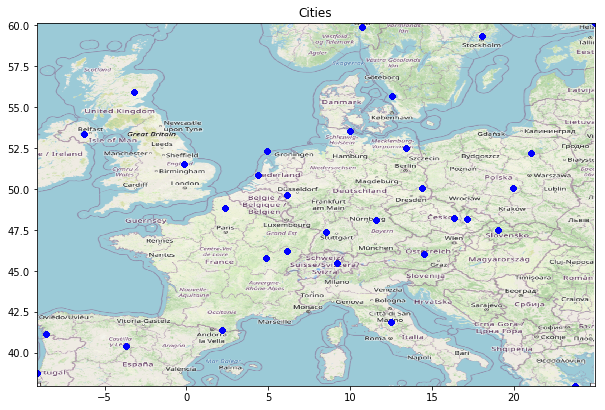
    


```python
# Кластеризация
x = data[['lng','lat']].values
kmeans.fit(x)
y_pred = kmeans.labels_.astype(np.int)

print ("Коэффициент силуэта: %0.3f" % silhouette_score(x, y_pred, metric='euclidean'))

plt.rcParams['figure.figsize'] = 10, 10
plt.scatter(x[:, 0], x[:, 1], c=y_pred, s=200, alpha=.5)
plt.scatter(kmeans.cluster_centers_[:, 0], kmeans.cluster_centers_[:, 1], c='red', s=200, marker='+')
ax.set_xlim(coor_box[0],coor_box[1])
ax.set_ylim(coor_box[2],coor_box[3])
ax.imshow(ta_map, zorder=0, extent = coor_box, aspect= 'equal')
plt.show()
```

    Коэффициент силуэта: 0.557


    

    


```python
# Добаление к основным данным
data['geo_cluster'] = y_pred
data.drop(['lat','lng'], axis=1, inplace=True)
cat_cols.append('geo_cluster')
```


```python
g_cluster = data[data.train==1].drop(['train','Restaurant_id'],axis=1)

# Обработка признаков
g_cluster = pd.get_dummies(g_cluster, columns = cat_cols, prefix=None, dummy_na=False)
g_cluster.drop(['population'],axis=1)

# Расчет метрики
results['g_cluster'] = MAE(X=g_cluster.drop('Rating', axis = 1), 
    y=g_cluster.Rating, model=RandomForestRegressor(random_state=RS))
print('MAE:\t',np.round(results['g_cluster'], 2))
```

    /opt/conda/lib/python3.6/site-packages/sklearn/ensemble/forest.py:245: FutureWarning: The default value of n_estimators will change from 10 in version 0.20 to 100 in 0.22.
      "10 in version 0.20 to 100 in 0.22.", FutureWarning)


    MAE:	 0.16


```python
results
```


    {'naive': 0.2827788894447224,
     'zeros': 0.18515507753876934,
     'median': 0.187456228114057,
     'frequent': 0.18678714357178586,
     'drop_CRN': 0.18569909954977487,
     'drop_city': 0.224146448224112,
     'drop_RL': 0.1853114057028514,
     'city_r': 0.1579227113556778,
     'dummy_cs': 0.15786643321660826,
     'rr_cluster': 0.15875437718859425,
     'country': 0.15514632316158075,
     'g_cluster': 0.15623436718359174}


Кластериция на регионы Европы не дает прибавки в точности модели. Признак может быть удален.


```python
data.drop('geo_cluster', axis=1, inplace=True)
cat_cols.remove('geo_cluster')
```

### 2.3. Population

Признак на основе населения образован путем деления на ретинг внутри города. Таким образом переменная выше для рестораннов из больших городов с высоким рейтингом. Чтобы распределение выглядело информативно, данные логорифмированы.


```python
data['pop2rank'] = np.log(data['population']/data['Ranking'])
num_cols.append('pop2rank')
data.sample(3)
```


<div>
<style scoped>
    .dataframe tbody tr th:only-of-type {
        vertical-align: middle;
    }

    .dataframe tbody tr th {
        vertical-align: top;
    }

    .dataframe thead th {
        text-align: right;
    }
</style>
<table border="1" class="dataframe">
  <thead>
    <tr style="text-align: right;">
      <th></th>
      <th>Restaurant_id</th>
      <th>City</th>
      <th>Ranking</th>
      <th>Rating</th>
      <th>Price Range</th>
      <th>Number of Reviews</th>
      <th>train</th>
      <th>cuisine_nan</th>
      <th>cuisine_amount</th>
      <th>p_range_nan</th>
      <th>rvws_amount</th>
      <th>rvws_time_span</th>
      <th>rvws_latest</th>
      <th>txt_cluster</th>
      <th>txt_length</th>
      <th>current_rating</th>
      <th>city_ranking</th>
      <th>country</th>
      <th>population</th>
      <th>pop2rank</th>
    </tr>
  </thead>
  <tbody>
    <tr>
      <th>44693</th>
      <td>id_932</td>
      <td>Prague</td>
      <td>933.0</td>
      <td>4.0</td>
      <td>2.0</td>
      <td>58.0</td>
      <td>1</td>
      <td>0</td>
      <td>6</td>
      <td>0</td>
      <td>2</td>
      <td>13478400.0</td>
      <td>1.500595e+09</td>
      <td>3.0</td>
      <td>6</td>
      <td>0.0</td>
      <td>0.222779</td>
      <td>Czechia</td>
      <td>1324277.0</td>
      <td>7.257972</td>
    </tr>
    <tr>
      <th>9957</th>
      <td>id_16086</td>
      <td>London</td>
      <td>16098.0</td>
      <td>4.0</td>
      <td>2.0</td>
      <td>16.0</td>
      <td>1</td>
      <td>0</td>
      <td>6</td>
      <td>0</td>
      <td>2</td>
      <td>8726400.0</td>
      <td>1.504742e+09</td>
      <td>2.0</td>
      <td>10</td>
      <td>4.0</td>
      <td>0.978959</td>
      <td>United Kingdom</td>
      <td>10979000.0</td>
      <td>6.525045</td>
    </tr>
    <tr>
      <th>18685</th>
      <td>id_177</td>
      <td>Porto</td>
      <td>178.0</td>
      <td>4.0</td>
      <td>2.0</td>
      <td>360.0</td>
      <td>1</td>
      <td>0</td>
      <td>5</td>
      <td>0</td>
      <td>2</td>
      <td>518400.0</td>
      <td>1.518221e+09</td>
      <td>5.0</td>
      <td>4</td>
      <td>4.0</td>
      <td>0.119946</td>
      <td>Portugal</td>
      <td>237591.0</td>
      <td>7.196522</td>
    </tr>
  </tbody>
</table>
</div>


```python
sum_up_num(data[data.train==1], 'pop2rank', 'Rating')
```

    POP2RANK
    mean     7.091479
    std      1.158466
    min      4.120968
    25%      6.444567
    50%      6.915398
    75%      7.607669
    max     16.211495
    Name: pop2rank, dtype: float64
    Кол-во выбросов: 2253 	 (%%: 5.64)
    


    
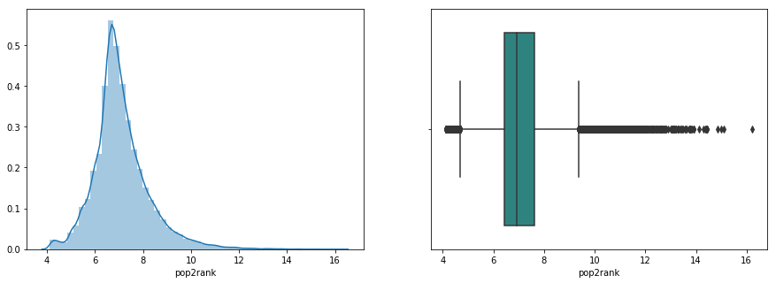
    


```python
# Корреляционная матрица
f, ax = plt.subplots(figsize=(15, 12))
sns.heatmap(data[data.train==1][num_cols].corr(), vmin=-1, vmax=1, annot=True, linewidths=.5, cmap='viridis')
```


    <matplotlib.axes._subplots.AxesSubplot at 0x7f14a25cfb00>


    
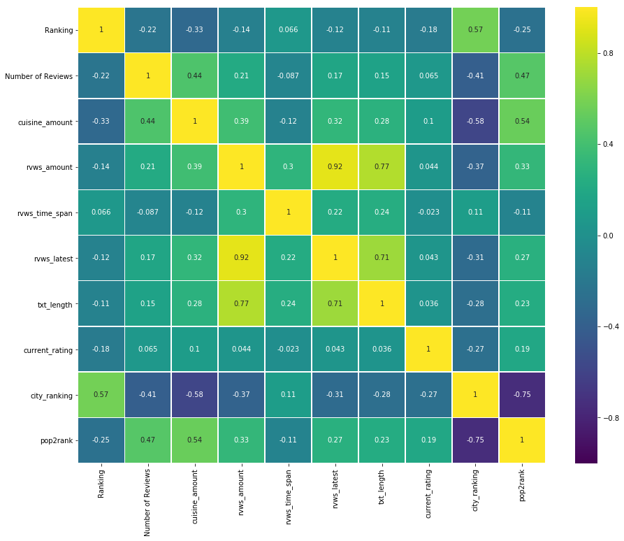
    


```python
pop2rank = data[data.train==1].drop(['train','Restaurant_id'],axis=1)

# Обработка признаков
pop2rank = pd.get_dummies(pop2rank, columns = cat_cols, prefix=None, dummy_na=False)

# Расчет метрики
results['pop2rank'] = MAE(X=pop2rank.drop('Rating', axis = 1), 
    y=pop2rank.Rating, model=RandomForestRegressor(random_state=RS))
print('MAE:\t',np.round(results['pop2rank'], 2))
```

    /opt/conda/lib/python3.6/site-packages/sklearn/ensemble/forest.py:245: FutureWarning: The default value of n_estimators will change from 10 in version 0.20 to 100 in 0.22.
      "10 in version 0.20 to 100 in 0.22.", FutureWarning)


    MAE:	 0.16


```python
results
```


    {'naive': 0.2827788894447224,
     'zeros': 0.18515507753876934,
     'median': 0.187456228114057,
     'frequent': 0.18678714357178586,
     'drop_CRN': 0.18569909954977487,
     'drop_city': 0.224146448224112,
     'drop_RL': 0.1853114057028514,
     'city_r': 0.1579227113556778,
     'dummy_cs': 0.15786643321660826,
     'rr_cluster': 0.15875437718859425,
     'country': 0.15514632316158075,
     'g_cluster': 0.15623436718359174,
     'pop2rank': 0.1556090545272636}


Переменая не улучшила результат и подлежит удалению.


```python
data.drop('pop2rank', axis=1, inplace=True)
num_cols.remove('pop2rank')
```

## Вывод


```python
plt.figure(figsize=(15, 5))
ax = sns.lineplot(x=[x for x in range(len(results.values()))], y=list(results.values()), marker='o')
ax.set(ylabel='MAE', xlabel='iter')
plt.show()

for key, value in results.items():
    print('{}: {}'.format(key, np.round(value, 4)))
```


    
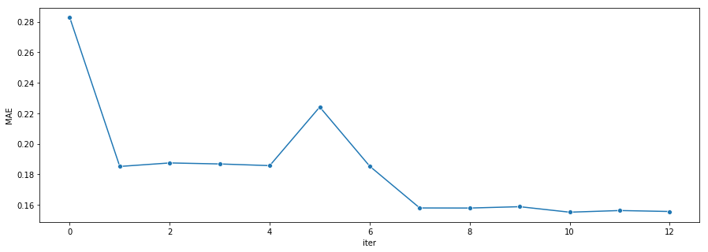
    


    naive: 0.2828
    zeros: 0.1852
    median: 0.1875
    frequent: 0.1868
    drop_CRN: 0.1857
    drop_city: 0.2241
    drop_RL: 0.1853
    city_r: 0.1579
    dummy_cs: 0.1579
    rr_cluster: 0.1588
    country: 0.1551
    g_cluster: 0.1562
    pop2rank: 0.1556


Из 4 протестированных переменных, только страна ресторана улучшила MAE.

# Model

Будут протестированы два ансабля моделей:
- Для случайного леса будут подобраны оптимальные параметры.
- Альтернативой будет градиентный бустинг.

GridSearch для ансаблей требует больших ресурсов. По этой причине, подбор оптиальных параметров производился вручную в отдельном ноутбуке без кросс-валидации.

Ссылка на ноутбук: https://github.com/blinnikov-ae/skillfactory_rds/blob/master/module_3/TripAdvisor_model_selection.ipynb


```python
# Обработка признаков
data = pd.get_dummies(data, columns = cat_cols, prefix=None, dummy_na=False)

model_selection = data[data.train==1].drop(['train','Restaurant_id'],axis=1)

# Разбиение выборки
X = model_selection.drop('Rating', axis = 1)
y = model_selection.Rating
X_train, X_test, y_train, y_test = train_test_split(X, y, test_size=0.20, random_state = RS)
```


```python
RF = RandomForestRegressor(random_state=RS, n_estimators=1000)

RF.fit(X_train, y_train)
RF_y_pred = RF.predict(X_test)
    
results['rf_model'] = mean_absolute_error(y_test, RF_y_pred)
```


```python
GB = GradientBoostingRegressor(random_state=RS, max_depth=10, n_estimators=58)

GB.fit(X_train, y_train)
GB_y_pred = GB.predict(X_test)
    
results['gb_model'] = mean_absolute_error(y_test, GB_y_pred)
```


```python
plt.figure(figsize=(15, 5))
ax = sns.lineplot(x=[x for x in range(len(results.values()))], y=list(results.values()), marker='o')
ax.set(ylabel='MAE', xlabel='iter')
plt.show()

for key, value in results.items():
    print('{}: {}'.format(key, np.round(value, 4)))
```


    
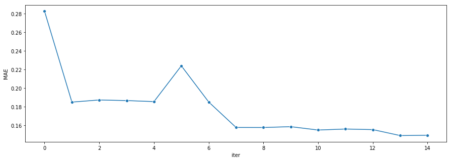
    


    naive: 0.2828
    zeros: 0.1852
    median: 0.1875
    frequent: 0.1868
    drop_CRN: 0.1857
    drop_city: 0.2241
    drop_RL: 0.1853
    city_r: 0.1579
    dummy_cs: 0.1579
    rr_cluster: 0.1588
    country: 0.1551
    g_cluster: 0.1562
    pop2rank: 0.1556
    rf_model: 0.1492
    gb_model: 0.1495


Обе модели показывают примерно одинаковый результат. RandomForest показывает себя чуть лучше.

## Обработка результатов моделей


```python
# Функция возвращяет результат модели приведенный к формату целевой переменной
def adjusted(y_pred):
    return np.round(y_pred*2)/2
```


```python
# MAE для обработоного результа RandomForest
results['rf_adj'] = mean_absolute_error(y_test, adjusted(RF_y_pred))
print('MAE:\t',np.round(results['rf_adj'],4))
```

    MAE:	 0.1166


```python
# MAE для обработоного результа GradientBoosting
results['gb_adj'] = mean_absolute_error(y_test, adjusted(GB_y_pred))
print('MAE:\t',np.round(results['gb_adj'],4))
```

    MAE:	 0.1153


Для обработанных результатов, GradientBoosting чуть точнее.


```python
# Разница значений
np.unique(np.absolute(adjusted(RF_y_pred)-adjusted(GB_y_pred)), return_counts=True)
```


    (array([0. , 0.5, 1. ]), array([7489,  503,    4]))


Предсказания отличаются для около 500та случаев. Можно попробовать улучшить результат, усреднив результаты двух моделей.


```python
results['combined'] = mean_absolute_error(y_test, np.round(adjusted(RF_y_pred)+adjusted(GB_y_pred))/2)
print('MAE:\t',np.round(results['combined'],4))
```

    MAE:	 0.1143


```python
# Проверка, что результаты не выбиваются из возможных пределов
np.unique(np.round(adjusted(RF_y_pred)+adjusted(GB_y_pred))/2)
```


    array([1. , 1.5, 2. , 2.5, 3. , 3.5, 4. , 4.5, 5. ])


## Вывод


```python
plt.figure(figsize=(15, 5))
ax = sns.lineplot(x=[x for x in range(len(results.values()))], y=list(results.values()), marker='o')
ax.set(ylabel='MAE', xlabel='iter')
plt.show()

for key, value in results.items():
    print('{}: {}'.format(key, np.round(value, 4)))
```


    
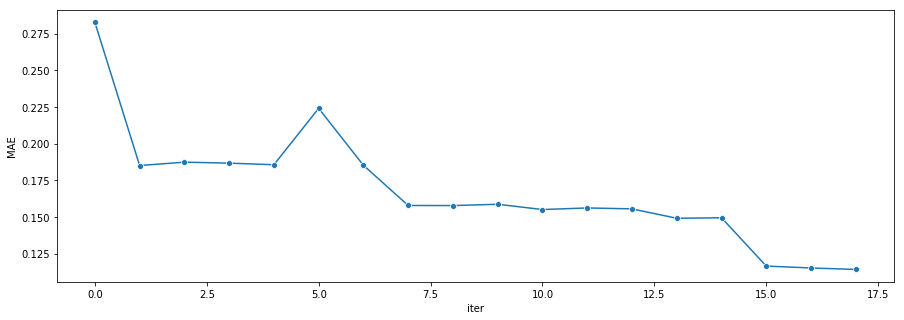
    


    naive: 0.2828
    zeros: 0.1852
    median: 0.1875
    frequent: 0.1868
    drop_CRN: 0.1857
    drop_city: 0.2241
    drop_RL: 0.1853
    city_r: 0.1579
    dummy_cs: 0.1579
    rr_cluster: 0.1588
    country: 0.1551
    g_cluster: 0.1562
    pop2rank: 0.1556
    rf_model: 0.1492
    gb_model: 0.1495
    rf_adj: 0.1166
    gb_adj: 0.1153
    combined: 0.1143


Обработка результатов моделирование дала существенное снижение MAE.

# Submission


```python
# Формат ответа
sample_submission.sample(3)
```


<div>
<style scoped>
    .dataframe tbody tr th:only-of-type {
        vertical-align: middle;
    }

    .dataframe tbody tr th {
        vertical-align: top;
    }

    .dataframe thead th {
        text-align: right;
    }
</style>
<table border="1" class="dataframe">
  <thead>
    <tr style="text-align: right;">
      <th></th>
      <th>Restaurant_id</th>
      <th>Rating</th>
    </tr>
  </thead>
  <tbody>
    <tr>
      <th>7812</th>
      <td>id_7812</td>
      <td>2.5</td>
    </tr>
    <tr>
      <th>1826</th>
      <td>id_1826</td>
      <td>3.0</td>
    </tr>
    <tr>
      <th>7529</th>
      <td>id_7529</td>
      <td>3.5</td>
    </tr>
  </tbody>
</table>
</div>


```python
# Проверка размерности
print(sample_submission.shape)
print(data[data.train==0].shape)
```

    (10000, 2)
    (10000, 78)


```python
# Предобработка
submission = data[data.train==0].drop(['train'],axis=1)
rest_id = submission.Restaurant_id
submission = submission.drop(['Restaurant_id'],axis=1)

# Предсказание
X_valid = submission.drop('Rating', axis = 1)
predictions = np.round(adjusted(RF.predict(X_valid))+adjusted(GB.predict(X_valid)))/2
```


```python
# Запись
sample_submission['Restaurant_id'] = rest_id.values
sample_submission['Rating'] = predictions
sample_submission.to_csv('submission.csv', index=False)
sample_submission.head(10)
```


<div>
<style scoped>
    .dataframe tbody tr th:only-of-type {
        vertical-align: middle;
    }

    .dataframe tbody tr th {
        vertical-align: top;
    }

    .dataframe thead th {
        text-align: right;
    }
</style>
<table border="1" class="dataframe">
  <thead>
    <tr style="text-align: right;">
      <th></th>
      <th>Restaurant_id</th>
      <th>Rating</th>
    </tr>
  </thead>
  <tbody>
    <tr>
      <th>0</th>
      <td>id_0</td>
      <td>3.5</td>
    </tr>
    <tr>
      <th>1</th>
      <td>id_5</td>
      <td>4.0</td>
    </tr>
    <tr>
      <th>2</th>
      <td>id_15</td>
      <td>3.0</td>
    </tr>
    <tr>
      <th>3</th>
      <td>id_31</td>
      <td>5.0</td>
    </tr>
    <tr>
      <th>4</th>
      <td>id_34</td>
      <td>4.5</td>
    </tr>
    <tr>
      <th>5</th>
      <td>id_35</td>
      <td>4.0</td>
    </tr>
    <tr>
      <th>6</th>
      <td>id_38</td>
      <td>4.0</td>
    </tr>
    <tr>
      <th>7</th>
      <td>id_41</td>
      <td>3.0</td>
    </tr>
    <tr>
      <th>8</th>
      <td>id_45</td>
      <td>3.0</td>
    </tr>
    <tr>
      <th>9</th>
      <td>id_46</td>
      <td>4.0</td>
    </tr>
  </tbody>
</table>
</div>


```python

```
